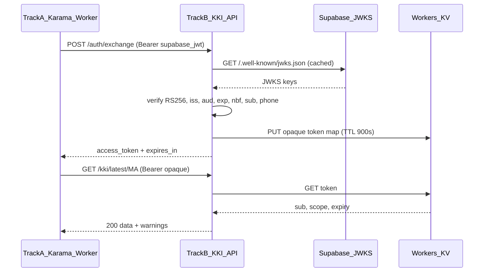

# KKI Closed API Contract (Track B)

> **Task:** §2.3B of [`masterTODO.md`](../../../docs/masterTODO.md)  
> **Status:** ✅ Complete  
> **Date:** 2026-05-11  
> **Authored by:** API-contract designer pass per §2.3B prompt; STOA loop run.  
> **Depends on:**
> - [`khobz-index/docs/architecture/stack.md`](./stack.md) (§2.1B — Workers + Hono, R2/KV)
> - [`khobz-index/docs/architecture/data-schema.md`](./data-schema.md) (§2.2B — IndexRecord, BasketVersion)
> - [`docs/kki/kki_research.md`](../../../docs/kki/kki_research.md) (§7.2 closed API + static archive)
> - [`docs/architecture/api.md`](../../../docs/architecture/api.md) (§2.3A — Track A = **only** consumer)
> - [`docs/strategy/feasibility-validation.md`](../../../docs/strategy/feasibility-validation.md) (§4.3 — $0 ops at MVP)
>
> **Normative machine-readable spec:** [`openapi.yaml`](./openapi.yaml) (OpenAPI 3.1)  
> **Implementation (Workers):** [`../../src/api/index.ts`](../../src/api/index.ts) — §**3.5B** ✅ 2026-05-11 (Hono + R2/KV; see [`README.md`](../../README.md) § Closed API).

---

## TL;DR

- **Runtime:** Cloudflare Workers + Hono; data from R2 / Workers KV (see [`stack.md`](./stack.md)). **$0** at MVP within Cloudflare free tier ([`feasibility-validation.md`](../../../docs/strategy/feasibility-validation.md) §4.3).
- **Who may call:** Only the **Karama backend Worker** (Track A). The React Native app **never** calls this hostname directly ([`api.md`](../../../docs/architecture/api.md) §1).
- **Auth:** `POST /auth/exchange` accepts a **Supabase session JWT** (Authorization header), verifies signature via **Supabase JWKS**, mints an **opaque** KKI access token (**15 min TTL**, scope `kki:read`). All **data** routes require that token.
- **No anonymous tier at MVP:** Missing/invalid auth on data routes ⇒ **401** (`unauthorized`). Public/research consumers use the **static archive** (GitHub Releases / IPFS / Internet Archive), not this API.
- **Cross-track:** Response bodies are shaped so Track A can map fields to `KkiRatePayloadSchema` and cache rows in `kki_rate_cache` ([`api.md`](../../../docs/architecture/api.md) §7.3–§10).

---

## 1. Access boundary (closed API at MVP)

| Surface | Auth | Audience |
|--------|------|----------|
| `POST /auth/exchange` | Supabase **user** JWT (`Bearer`) | Track A Worker only |
| `GET /kki/*`, `GET /basket/*` | KKI **opaque** access token (`Bearer`) | Track A Worker only |
| `GET /health` | **None** | Operators, probes, Track A healthchecks |

**Explicit rule:** Any request to a data endpoint **without** a valid KKI access token MUST receive **401** with body [`ErrorResponse`](#6-error-response-schema) and `error.code: unauthorized`. There is **no** public read key, API key, or IP allowlist bypass for data at MVP.

**Public data path:** Journalists, researchers, and the static landing page (`https://khobz-index.thebay.ma/`) consume **[§7 Static archive contract](#7-static-archive-contract)** only — same pattern as Big Mac open data, zero anonymous load on running API ([`kki_research.md`](../../../docs/kki/kki_research.md) §7.2). **Do not publish** the Worker hostname in public docs; operators see internal URLs in [`runbook.md`](../ops/runbook.md).

---

## 2. Endpoint catalogue

Base path: implementation mounts under `/` on a **private** Cloudflare Worker hostname (internal operators + Track A only). Spec paths below are **relative** to that origin. **No public API URL** is published for v1.

Content type for JSON: `application/json; charset=utf-8`.

### 2.1 `POST /auth/exchange`

Exchanges a **Supabase Auth access token** (JWT) for a **short-lived KKI access token**.

**Request**

- **Headers:** `Authorization: Bearer <supabase_access_jwt>`
- **Body:** `{}` (empty JSON object) — token is taken only from the header.

**Response `200`**

```json
{
  "access_token": "kki_at_…",
  "token_type": "Bearer",
  "expires_in": 900,
  "scope": "kki:read"
}
```

| Field | Type | Notes |
|-------|------|--------|
| `access_token` | string | Opaque, unguessable (≥128 bits entropy). Not a JWT. |
| `token_type` | string | Literal `"Bearer"`. |
| `expires_in` | integer | Seconds until expiry (**900** = 15 minutes). |
| `scope` | string | Literal `"kki:read"`. |

**Errors:** [`unauthorized`](#61-http-error-codes), [`rate-limited`](#61-http-error-codes), [`validation-error`](#61-http-error-codes), [`internal-error`](#61-http-error-codes).

---

### 2.2 `GET /kki/:country/:month`

Returns the **IndexRecord** for a country and calendar month.

**Path parameters**

| Param | Pattern | Example |
|-------|---------|---------|
| `country` | ISO 3166-1 alpha-2 **uppercase** | `MA` |
| `month` | `YYYY-MM` | `2026-04` |

**Query parameters (optional)**

| Param | Description |
|-------|-------------|
| `methodology_version` | Semver (e.g. `1.0.0`). If the stored record’s `methodology_version` does not match, the response is still **200** with the available record and a **`version-mismatch`** entry in `warnings[]` (Track A maps to `freshness: version_mismatch`). |

**Auth:** `Authorization: Bearer <kki_access_token>`

**Response `200`**

Envelope wraps the canonical **IndexRecord** from [`data-schema.md`](./data-schema.md) §3:

```typescript
// Conceptual shape (implement with Zod in worker)
interface KkiRecordResponse {
  data: IndexRecord;   // §3.1 data-schema.md — all fields required
  warnings?: Warning[]; // optional: source-degraded, stale-data, version-mismatch
}
```

`IndexRecord` fields (normative): `country_code`, `month`, `kki_value`, `kki_value_usd`, `currency`, `alpha`, `local_basket_cost`, `global_basket_cost`, `basket_version`, `methodology_version`, `computed_at`, `source_summary`, `quality`, `record_hash`.

**Errors:** [`unauthorized`](#61-http-error-codes), [`not-found`](#61-http-error-codes), [`rate-limited`](#61-http-error-codes), [`internal-error`](#61-http-error-codes).

---

### 2.3 `GET /kki/latest/:country`

Returns the **most recent** computed IndexRecord for `country` (per manifest / snapshot index in R2 or KV).

Path, query (`methodology_version`), auth, and response envelope match §2.2.

**Errors:** Same as §2.2. If no data exists for the country: **404** `not-found`.

---

### 2.4 `GET /basket/:version`

Returns **basket definitions** for a **methodology semver** `version` (e.g. `1.0.0`).

This mirrors the contents of `data/v{major}.{minor}/baskets.json` in [`data-schema.md`](./data-schema.md) §5.2: all `BasketVersion` objects whose `methodology_version` equals the requested semver.

**Path parameters**

| Param | Pattern | Example |
|-------|---------|---------|
| `version` | `MAJOR.MINOR.PATCH` | `1.0.0` |

**Auth:** `Authorization: Bearer <kki_access_token>`

**Response `200`**

```json
{
  "methodology_version": "1.0.0",
  "baskets": [ /* BasketVersion × N per data-schema §1 */ ]
}
```

**Note:** To fetch a **single** basket by `basket_id` (e.g. `mena-v1.0`), clients MAY filter the `baskets` array client-side; a dedicated path is not required at MVP.

**Errors:** [`unauthorized`](#61-http-error-codes), [`not-found`](#61-http-error-codes), [`rate-limited`](#61-http-error-codes), [`internal-error`](#61-http-error-codes).

---

### 2.5 `GET /health`

**Unauthenticated** pipeline and dependency summary for probes.

**Response `200`**

```json
{
  "ok": true,
  "service": "khobz-index-api",
  "time": "2026-05-11T07:30:00.000Z",
  "pipeline": {
    "status": "healthy",
    "last_successful_run_at": "2026-05-05T06:20:00.000Z",
    "last_run_week_id": "2026-W19"
  },
  "sources": {
    "fao-fpi": "up",
    "faostat": "up",
    "wfp-vam": "degraded",
    "wb-pink-sheet": "up",
    "goldprice-dev": "up",
    "metals-dev": "up"
  }
}
```

| Field | Notes |
|-------|--------|
| `pipeline.status` | `healthy` \| `degraded` \| `unknown` — `degraded` if last successful run older than **14 days** or manifest stale. |
| `last_successful_run_at` | ISO 8601 UTC from latest successful weekly pipeline / snapshot publish. |
| `sources` | High-level reachability from last pipeline run or lightweight checks; **informational** only. |

---

## 3. Auth flow

### 3.1 Sequence



### 3.2 Supabase JWT verification

1. **Obtain JWKS** from the project’s Auth host:  
   `https://<project-ref>.supabase.co/auth/v1/.well-known/jwks.json`  
   (Same shape as self-hosted GoTrue in Context7 `/supabase/auth`: `keys[]` with `kid`, `alg` RS256, etc.)

2. **Validate**
   - Signature using **RS256** only (reject `none`, do not trust header `alg` without allowlist).
   - **`exp` / `nbf`:** standard validation with **clock skew tolerance ±30 seconds** between Workers edge and Supabase.
   - **`iss`:** must equal configured issuer (`https://<project-ref>.supabase.co/auth/v1` or deployment-specific URI).
   - **`aud`:** must match configured audience (`authenticated` per Supabase JWT claims).
   - **`sub`:** present (UUID of auth user).

3. **JWKS caching:** Cache JWKS in Workers KV (or in-memory with edge TTL **~1 hour**). On fetch failure, reuse **stale** JWKS up to **24 hours** (key rotation is rare); if no valid keys, return **503** with `internal-error` or fail closed on exchange with **401** per product policy — **MVP recommendation:** **401** `unauthorized` on verify failure to avoid anonymous data leakage.

### 3.3 KKI access token (opaque)

| Property | Value |
|----------|--------|
| Format | Opaque string, `kki_at_` prefix optional; **not** parseable by clients. |
| Storage | Server-side map in KV: `token_id → { sub, scope, exp }`. |
| TTL | **900 seconds** (15 minutes), enforced by KV TTL + `exp` check. |
| Scope | `kki:read` only at MVP. |
| Binding | One token row per mint; includes `sub` from Supabase JWT for audit. |

**Authoritative TTL:** **15 minutes** (`900` seconds) here and in [`openapi.yaml`](./openapi.yaml). [`kki_research.md`](../../../docs/kki/kki_research.md) §7.2 matches; any stray “5-minute” copy elsewhere is obsolete.

### 3.4 Refresh and revocation

- **Refresh:** No refresh token. When `expires_in` elapses, Track A calls `POST /auth/exchange` again with the current Supabase session JWT.
- **Revocation (immediate):** Delete KV key for a token (or flip a denylist bit) — next data request returns **401**. Use for incident response; normal expiry handles routine rotation.
- **User logout:** Supabase session ends client-side; outstanding KKI tokens remain valid until TTL unless explicitly revoked — acceptable bounded window (15 min).

---

## 4. Rate limits

Enforced at Cloudflare edge / Worker middleware. Limits are **per rolling 60-second window** unless noted.

| Class | Routes | Key | Limit |
|-------|--------|-----|-------|
| **DATA** | `GET /kki/*`, `GET /basket/*` | Hash of `kki_access_token` | **60** requests / minute |
| **EXCHANGE** | `POST /auth/exchange` | Supabase JWT claim `sub` | **10** requests / minute |
| **HEALTH** | `GET /health` | Client IP (CF `cf-connecting-ip` or equivalent) | **120** requests / minute |

**429 response**

- Header: `Retry-After: <seconds>` — seconds until the client should retry.
- Body: [`ErrorResponse`](#61-http-error-codes) with `error.code: rate-limited`.

**Recommendation:** Track A caches KKI access token until ~60s before `exp` to stay under **EXCHANGE** limits.

---

## 5. Conditional responses (200 + warnings)

Degraded but **usable** data is delivered as **200 OK** with `warnings[]`. This aligns Track B with Track A [`api.md`](../../../docs/architecture/api.md) §7.3 (`warnings`, `degraded`, `freshness`).

| Code | HTTP | When | Client (Track A) behavior |
|------|------|------|---------------------------|
| `source-degraded` | 200 | Partial inputs, fallback sources, or `quality` is `degraded` / non-full | Set `degraded: true`; include warning in `warnings[]`; surface in UI if needed. |
| `stale-data` | 200 | Serving last-known-good from KV/R2 while upstream snapshot refresh failed | Map to `freshness: stale`; pair with cache metadata if propagated. |
| `version-mismatch` | 200 | Query `methodology_version` ≠ record’s `methodology_version` | Map to `freshness: version_mismatch`; prefer bundled snapshot for display per R-K5. |

**Hard failures** (no row, auth, limits) use §6 error codes.

---

## 6. Error response schema

### 6.1 HTTP error codes

All error responses use this **JSON envelope**:

```json
{
  "error": {
    "code": "unauthorized",
    "message": "Human-readable, safe for logs/UI",
    "details": {},
    "request_id": "optional-correlation-id"
  }
}
```

| `error.code` | HTTP | Meaning | Recommended client behavior |
|--------------|------|---------|-----------------------------|
| `unauthorized` | **401** | Missing/invalid/expired Supabase JWT or KKI token | Re-exchange or refresh Supabase session; never retry blindly with same token. |
| `rate-limited` | **429** | Limit exceeded | Back off per `Retry-After`; reduce concurrency. |
| `not-found` | **404** | Unknown country/month or basket file | Fall back to bundled snapshot or static archive. |
| `validation-error` | **400** | Bad path/query/body | Fix request shape. |
| `internal-error` | **500** | Unexpected server failure | Retry with jitter; alert if persistent. |

### 6.2 Service unavailable

When storage (R2/KV) is unreachable and **no** body can be served:

- **503** with `error.code: internal-error` **or** a dedicated `service-unavailable` in future — MVP MAY use `internal-error` with message clarifying upstream storage.

Track A maps total outage to [`api.md`](../../../docs/architecture/api.md) `source_unavailable` when cache is also empty.

### 6.3 Warning objects (200)

```json
{
  "code": "source-degraded",
  "message": "One or more sources used fallback tier",
  "details": {
    "quality": "degraded",
    "missing_sources": ["wfp-vam"]
  }
}
```

Codes: `source-degraded`, `stale-data`, `version-mismatch` (kebab-case in JSON for this API; Track A may normalize to snake_case in its own envelope).

---

## 7. Static archive contract

Public consumers **do not** use the closed API. They use **GitHub Releases** (and mirrors).

### 7.1 Release asset naming

For each publication month `YYYY-MM`:

| Asset | Description |
|-------|-------------|
| `khobz-index-YYYY-MM.json` | Bundled / composite JSON for that month (schema compatible with [`data-schema.md`](./data-schema.md) §5.3–5.4 — per-country or merged manifest; pipeline defines exact merge). |
| `khobz-index-YYYY-MM.csv` | Flat CSV per §5.4 columns |

Example: `khobz-index-2026-04.json`, `khobz-index-2026-04.csv`.

### 7.2 JSON / CSV schema

- **JSON:** Conforms to **§2.2B** — `schema_version`, `index_record`, optional embedded `snapshot` per [`data-schema.md`](./data-schema.md) §5.3 for per-country files; release may ship a **rollup** file documenting its layout in release notes.
- **CSV:** Columns per **§5.4** (`country_code`, `month`, `kki_value`, …, `record_hash`).

Encoding: **UTF-8**, no BOM. CSV: POSIX `.` decimal separator.

### 7.3 IPFS

- **CID** of the pin for `khobz-index-YYYY-MM.{json,csv}` published in **GitHub Release notes** (Markdown): e.g. `IPFS (json): bafy…`.

### 7.4 Internet Archive mirror

URL pattern (Wayback “all captures” for the release asset):

`https://web.archive.org/web/*/https://github.com/The-Tech-Bay/khobz-index/releases/download/khobz-index-YYYY-MM/khobz-index-YYYY-MM.json`

Canonical public repo: [The-Tech-Bay/khobz-index](https://github.com/The-Tech-Bay/khobz-index).

---

## 8. Cross-track compatibility (Track A)

Track A is the **only** consumer. Mapping from this API to [`api.md`](../../../docs/architecture/api.md):

| Track B (this contract) | Track A (`api.md` §7) |
|------------------------|------------------------|
| `POST /auth/exchange` | Worker internal call; mirrors `POST /v1/kki/token` upstream target |
| `GET /kki/latest/:country` | Upstream for `GET /v1/kki/:country/latest` |
| `GET /kki/:country/:month` | Upstream for `GET /v1/kki/:country/:month` (`:month` is `YYYY-MM-01` in Track A path — same calendar month as Track B `YYYY-MM`) |
| `data.kki_value` (number) | `data.kk_value` (**decimal string** in JSON) |
| `data.methodology_version` | `data.kki_version` |
| `data.basket_version`, `data.alpha`, `data.source_summary`, `data.quality`, `data.computed_at` | Same semantics; `source_summary` is a **typed array** of slot contributions per [`data-schema.md`](./data-schema.md) §3.1 and [`openapi.yaml`](./openapi.yaml) — **not** a JSON object |
| `warnings[]` with `source-degraded` | `degraded: true`, `warnings[].code: source_degraded` |
| `warnings[]` `stale-data` | `freshness: stale`, warning `stale_data` |
| `warnings[]` `version-mismatch` | `freshness: version_mismatch` |
| 401 | Re-run exchange / refresh session |
| 404 / 503 | Track A cache / `source_unavailable` per §7.3 algorithm |

**Contract gap rule:** New optional fields on `IndexRecord` MUST be backward-compatible; Track A passes unknown fields through **`source_summary`** or dedicated columns when added to `kki_rate_cache` migrations.

**Path naming:** Track B uses **`YYYY-MM`** in the path; Track A historical route uses **`YYYY-MM-01`**. Implementations MUST treat both as the same calendar month (`date_trunc('month', …)`).

### 8.1 Track A schema correction (§2.6A)

[`api.md`](../../../docs/architecture/api.md) currently sketches `kki_rate_cache.source_summary` as `z.record(z.unknown())`, which **rejects arrays** at parse time. Track B always emits an **array** matching `SourceContribution[]`. **§2.6A must** change Track A to accept the array, e.g. `z.array(z.record(z.unknown())).optional().nullable()`, `z.unknown()`, or a typed array aligned with §2.2B — so the Worker can persist upstream JSON without coercing shape.

---

## 9. STOA loop

### 9.1 Context

- §2.1B chose Workers + Hono for serving; §2.2B locked **IndexRecord** / **BasketVersion** shapes.
- §2.3A defined the Karama Worker proxy, cache, and freshness enum **before** this file; this contract completes the cross-track bridge.
- §7.2 `kki_research.md` mandates closed API + static archive at MVP.

### 9.2 Impact

| Downstream | Consumes |
|------------|----------|
| §2.4B KKI Architecture | Endpoint topology, WAF, KV bindings |
| §3.5B KKI API implementation | Exact paths, auth, errors |
| §3.6B Static archive | §7 naming + schema |
| §3.3A Track A | Stable upstream OpenAPI for proxy implementation |

### 9.3 Risks and mitigations

| Risk | Mitigation |
|------|------------|
| **Token replay** | Opaque token stored server-side with TTL; validate on every request; optional reuse detection via single-use nonce not required at MVP due to short TTL. |
| **Clock skew** | ±30s leeway on JWT `exp`/`nbf`; Workers NTP-synced. |
| **JWKS rotation** | Cached JWKS + stale fallback window; monitor 401 spikes after rotation. |
| **Rate-limit bypass** | DATA limits keyed by **token**, EXCHANGE by **`sub`**, not only IP. |
| **Cache poisoning** | API worker is **read-only**; only pipeline writes R2/KV; no user content in cache keys. |
| **R-K4 / R-K5** (`kki_research.md` §8) | Crisis markets + supply shocks: `quality`, `warnings`, and `source_summary` expose degradation; no silent wrong methodologyVersion. |

### 9.4 Verify DoD (§2.3B masterTODO)

- [x] Endpoint catalogue: `GET /kki/:country/:month`, `GET /kki/latest/:country`, `GET /basket/:version`, `GET /health`, `POST /auth/exchange`.
- [x] Auth: Supabase JWT → JWKS verify → opaque 15-min KKI token.
- [x] Rate limits per token / per user / health per IP; 429 + `Retry-After`.
- [x] No anonymous data tier — 401 documented.
- [x] Static archive: naming, JSON/CSV alignment with §2.2B, IPFS + IA patterns.
- [x] Typed errors: `source-degraded`, `stale-data`, `version-mismatch` (200 warnings); `unauthorized`, `rate-limited`, `not-found`, etc.
- [x] Cross-track: §8 compatibility with Track A §2.3A.

---

## Cross-references

- §2.6B alignment audit: [`../alignment-audit.md`](../alignment-audit.md)
- OpenAPI 3.1: [`openapi.yaml`](./openapi.yaml)
- Data schema: [`data-schema.md`](./data-schema.md)
- Stack: [`stack.md`](./stack.md)
- Platform architecture §2.4B: [`architecture.md`](./architecture.md)
- Track A API: [`docs/architecture/api.md`](../../../docs/architecture/api.md)
- Master TODO: [`docs/masterTODO.md`](../../../docs/masterTODO.md) §2.3B — pipeline/WAF topo in [`architecture.md`](./architecture.md) §2.4B

---

*End of §2.3B KKI API Contract. Operational deploy & pipeline details: [`architecture.md`](./architecture.md).*
