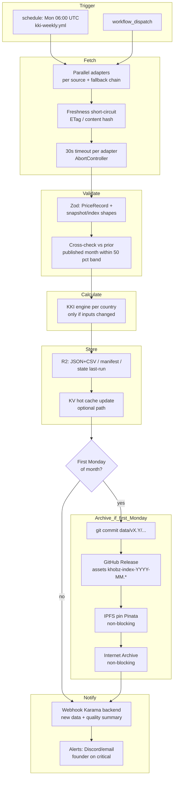
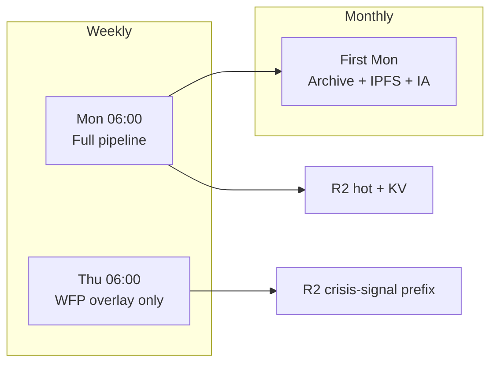
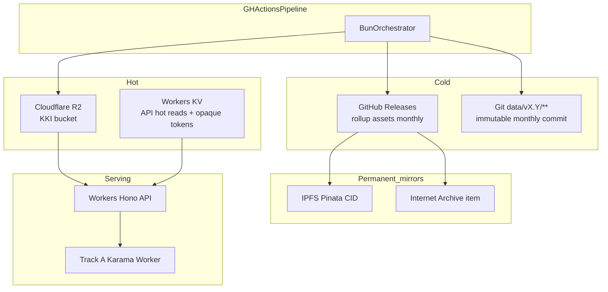
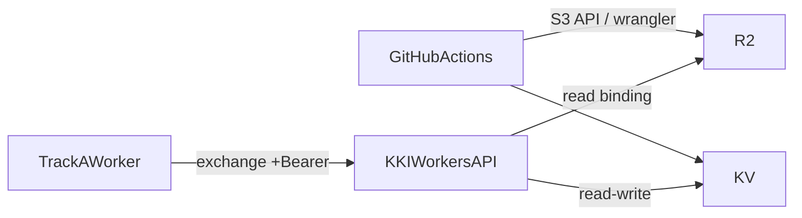

# KKI Pipeline & Platform Architecture

> **Task:** §2.4B of [`masterTODO.md`](../../../docs/masterTODO.md)  
> **Status:** ✅ Complete  
> **Date:** 2026-05-11  
> **Authored by:** Solutions-architect pass per §2.4B prompt; STOA loop run.  
> **Depends on:**
> - [`khobz-index/docs/architecture/stack.md`](./stack.md) (§2.1B — split runtime, adapters, redundancy chains)
> - [`khobz-index/docs/architecture/data-schema.md`](./data-schema.md) (§2.2B — entities, dual-publish, naming)
> - [`khobz-index/docs/architecture/api-contract.md`](./api-contract.md) (§2.3B — Track B surface, auth, archive naming)
> - [`docs/kki/kki_research.md`](../../../docs/kki/kki_research.md) (§4 sources, §3 formula, §7.2 closed API / static archive, §8 risks)
> - [`docs/strategy/feasibility-validation.md`](../../../docs/strategy/feasibility-validation.md) (§4.3 cost ceiling; KKI infra ~$0 row)

---

## TL;DR

- **Split architecture (unchanged from §2.1B):** GitHub Actions + **Bun** run the **pipeline** (multi-minute CPU, adapters, Zod validation, KKI engine). **Cloudflare Workers + Hono** serve the **closed API** (read R2/KV, &lt;10ms CPU).
- **Cadence:** KKI refreshes source checks weekly and publishes canonical country records at monthly grain. **Weekly** primary pipeline (Monday 06:00 UTC); **weekly** WFP **crisis overlay** (Thursday 06:00 UTC) writes **crisis-signal** snapshots only — **no new KKI**. **Monthly archive gate** on the **first Monday** of each month: Git commit under `data/` + GitHub Release + IPFS pin + Internet Archive.
- **Publish quality:** Per country, **≥60% of basket weight** must have **priced observations** from surviving sources after fallbacks → **publishable** (may be `degraded` or `global_only`). Below threshold → **skip-country-month** for that country. Shared **global slot** failure can force **skip-week** (all countries) if no global track.
- **Timeouts & budget:** **30s** per adapter; **5 min** total pipeline job budget; **3×** R2 write retry then **GitHub Release-only** fallback; IPFS/IA failures **non-blocking** with next-day retry.

---

## 1. Pipeline DAG

End-to-end directed acyclic flow from schedule to notification. Stages are sequential; **Fetch** runs parallel adapter tasks internally.



### 1.1 Stage contract

| Stage | Responsibility | Outputs / side effects |
|---|---|---|
| **Trigger** | Start weekly run; manual re-run | Workflow run ID, `GITHUB_RUN_ID` for logs |
| **Fetch** | Invoke `SourceAdapter`s in parallel per §2.1B; freshness-aware skip; retries (orchestrator, 2× backoff per stack.md) after first pass | Raw → normalized **PriceRecord** streams; adapter metadata |
| **Validate** | **Zod** at adapter boundaries + snapshot assembly (see [`data-schema.md`](./data-schema.md)); sanity: each commodity-country price vs **prior published month** ±**50%** — outliers → flagged `degraded`, exclude record or abort slot per policy | Validated inputs; degradation flags |
| **Calculate** | Apply hybrid formula \( \mathrm{KKI} = \alpha \cdot \mathrm{LOCAL} + (1-\alpha) \cdot \mathrm{GLOBAL} \) per [`kki_research.md`](../../../docs/kki/kki_research.md) §3.2; respect **alpha-config** | **IndexRecord** + embedded snapshot for archive shape |
| **Store** | Write **dual format** paths consistent with §2.2B; update **manifest**; persist **FetchState** in `state/last-run.json` | R2 objects; optional KV pointers |
| **Archive** | **Monthly gate only:** commit `data/{version}/{CC}/{YYYY-MM}.{json\|csv}`, tag release, attach rollup assets per [`api-contract.md`](./api-contract.md) §7 | GH Release; CID + IA URL in notes |
| **Notify** | **POST** signed webhook to Karama Worker (secret in GH); payload: run id, month, ISO week, manifest hash, quality rollup | Backend cache invalidation / ops visibility |

---

## 2. Cadence

**Canonical schedules** (§2.5B workflows under [`../../.github/workflows/`](../../.github/workflows/): `ci.yml`, `kki-weekly.yml`, `publish.yml`; Thursday WFP overlay **not yet** implemented):

```yaml
# Primary — full pipeline
on:
  schedule:
    - cron: "0 6 * * 1" # Monday 06:00 UTC

# Crisis overlay — WFP only
on:
  schedule:
    - cron: "0 6 * * 4" # Thursday 06:00 UTC
```

### 2.1 Weekly primary pipeline (Monday)

- Runs **fetch → validate → calculate → store → (archive if gate) → notify**.
- **Freshness-aware adapters** (`changed: false`) skip heavy parse when upstream unchanged ([`stack.md`](./stack.md) §2.2).
- Recomputes KKI **per country when any basket/global input changed**; otherwise persists “no drift” breadcrumb only.

### 2.2 Weekly WFP crisis overlay (Thursday)

- **Scope:** `wfp-vam` adapter only; countries in **crisis cohort** (**&gt;20% MoM volatility** on monitored staples — flag source: pipeline config fed by volatility detector over last WFP datapoints).
- **Output:** `crisis-signal/{CC}/{YYYY-Www}.json` in **R2** (intermediate observation / metadata). **Does not** write a new **IndexRecord** or bump `manifest` month row.
- **Purpose:** Early warning for UX / journalism; aligns with crisis-weekly WFP cadence ([`stack.md`](./stack.md) §3.3).

### 2.3 Monthly archive gate

- Predicate: **`calendar Monday` is first Monday OR first Monday-aligned business rule** → same as §2.1B “first Monday” gate.
- Executes **Git** commit under repo path `data/v{major}.{minor}/…` ([`data-schema.md`](./data-schema.md) §5), **`khobz-index-YYYY-MM.{json,csv}`** Release assets ([`api-contract.md`](./api-contract.md) §7), IPFS CID + IA URLs in release notes.

### 2.4 Cadence diagram



---

## 3. Storage topology

Logical tiers: **hot** (R2 + KV), **cold** (Git + GitHub Releases), **permanent mirrors** (IPFS, Internet Archive).



### 3.1 R2 layout (recommended keys)

Mirrors **`data-schema.md`** semantics; **rolling retention: last 12 months** per country/version prefix (lifecycle rules delete older objects unless referenced by pinned release metadata).

**Prefix vs. git path:** In the repo, versioned files live under `data/v1.0/…` (see [`data-schema.md`](./data-schema.md) §5). **R2 object keys omit the `data/` prefix** — the bucket is already dedicated to KKI artifacts, so keys start at `v1.0/{CC}/…` parallel to the same `{version}` segment in git.

| Prefix | Contents |
|---|---|
| `v1.0/{CC}/{YYYY-MM}.json` | Per-country rollup (machine) |
| `v1.0/{CC}/{YYYY-MM}.csv` | Flat researcher CSV |
| `v1.0/global/{YYYY-MM}.json` | Shared global track |
| `v1.0/manifest.json` | Discovery + file hashes |
| `state/last-run.json` | Adapter outcomes, timings, freshness state |
| `crisis-signal/{CC}/{YYYY-Www}.json` | WFP overlay snapshots |

*\*Version directory tracks methodology **major.minor** per [`data-schema.md`](./data-schema.md) §5 — patch bumps do not change path.*

**Runtime module:** [`../../src/storage/`](../../src/storage/) ships `persistCountryMonth` (dual-publish + manifest), SHA-256 metadata (`integrity.ts`), `reader.ts`, gzip-budgeted `bundle.ts`, and tests under `tests/unit/storage/`.

**Static archive module (§3.6B):** [`../../src/archive/`](../../src/archive/) — `runMonthlyArchive` orchestrates GitHub Release (`vYYYY-MM` + `khobz-index-YYYY-MM.{json,csv}`), Pinata IPFS pin (non-blocking), Internet Archive S3-compatible upload (non-blocking), then patches release notes with mirror URLs; writes `data/archive-log.json` + `data/ipfs-manifest.json`. Tests: `tests/unit/archive/`. Public consumer guide: [`../../data/README.md`](../../data/README.md).

### 3.2 Free-tier headroom (KKI infra)

| Component | Typical free-tier anchor (verify at deploy) | KKI MVP expectation |
|---|---|---|
| R2 | 10 GB, 10M Class B reads / mo ([Cloudflare R2 pricing](https://developers.cloudflare.com/r2/pricing/)) | &lt;&lt;1 MB hot set |
| Workers | 100k requests / day ([Workers limits](https://developers.cloudflare.com/workers/platform/limits/)) | ~8k API reads / month |
| KV | reads/writes quotas per account ([KV pricing](https://developers.cloudflare.com/kv/platform/pricing/)) | low — tokens + JWKS shadow |
| GitHub Actions private | ~2000 min / month free | ~12–20 min / month |

**Cost framing:** Track B **infra** aligns with **`feasibility-validation.md`** KKI row (~**$0** recurring at MVP scale). Whole-product spend is capped separately by **`feasibility-validation.md`** §4.3 (**≤ $0.10 / AU / month at MVP**) — SMS and other lanes may dominate; Track B stays intentionally minimal.

---

## 4. Redundancy & degradation matrix

### 4.1 Global publishability threshold

Define **weighted coverage** \(W\) over the **seven regional basket commodities** after **best-source-wins** assembly ([`data-schema.md`](./data-schema.md) §2.2):

- **Publishable-month (country)** if \( W \geq 0.6 \) (≥**60%** basket weight observable).
- **Skip-country-month** if \( W < 0.6 \) unless policy explicitly extends carry-forward (**not default** — prefer skip + transparency).

Parallel rule for **GLOBAL track** slots (FAO cereals/oils/sugar + Brent + gold): failure to produce **GLOBAL_basket** blocks **all** countries → **Skip-week** workflow outcome (critical alert).

### 4.2 Data-slot fallbacks vs skip

Aligned with [`stack.md`](./stack.md) §5.1–5.3; below states **effective** outcomes when named source is Down during the monthly/weekly aggregation window after retries.

#### Global cereals/oils/sugar (~35% of formula via global composite)

| If down | Fallback | Effective outcome |
|---|---|---|
| **FAO FPI** (`fao-fpi`) | WB Pink Sheet → USDA FAS PSD bulk | Usually **publishable-degraded** if any fallback succeeds |
| **WB Pink Sheet** (`wb-pink-sheet`) | FAO dominates slot; WB also backs cereals | Usually **publishable-degraded** if FAO + gold/energy pathways succeed |
| **USDA PSD** *(tertiary)* | Rarely needed | **OK** if primaries up |

**Skip-week:** **all** global-cereal paths + **no** acceptable substitute for the global composite (extremely rare).

#### Local market prices (~65% local leg before α)

| If down | Fallback | Country outcome |
|---|---|---|
| **WFP VAM** (`wfp-vam`) | FAOSTAT → national stat (per country) | **Degraded** or **global_only** (α=0) if no local |
| **FAOSTAT** (`faostat`) | WFP → national stat | Same |
| **National stat** | WFP + FAOSTAT | Same |

**Skip-country-month:** **no** local AND **optional rule:** if global-only would still yield \(W \geq 0.6\) on global leg only — still allowed as **`global_only`** per [`data-schema.md`](./data-schema.md) §3; if **both** local data **and** global track missing for that month → skip.

#### Gold spot

| If down | Fallback | Outcome |
|---|---|---|
| **Goldprice.dev** | Metals.dev → LBMA CSV | **Publishable** |
| **Metals.dev** | Goldprice → LBMA | **Publishable** |
| **LBMA CSV** | API wrappers | **Publishable** |
| **All three** | Last-cached gold with `stale_gold` | **Degraded-but-publishable** |

#### Crude / energy (Brent)

| If down | Fallback | Outcome |
|---|---|---|
| **WB Pink Sheet** | EIA STEO | **Publishable** |
| **EIA STEO** | WB | **Publishable** |
| **Both** | Last-cached energy | **Degraded-but-publishable** |

#### FX display (not an index input)

| If down | Fallback | Outcome |
|---|---|---|
| **Frankfurter** | exchangerate.host | **Display OK** |
| **Both** | Show “FX unavailable”; USD field may use last rate | **Degraded display**; **index math unchanged** |

### 4.3 Per-source matrix (reliability §2.1B)

**During a run**, if the **listed source** is unavailable (timeouts, 5xx, validation failure):

| Source | Tier | Typical outcome when this leg fails alone | Escalates to skip when |
|---|---|---|---|
| **FAO FPI** | 1 | Fallback global cereals succeed | Global cereals composite **lost** entirely |
| **FAOSTAT** | 1 | WFP/other local covers | Combined local failure + coverage &lt; 60% |
| **WFP VAM** | 1 | FAOSTAT absorbs | Combined local failure + coverage &lt; 60% |
| **WB Pink Sheet** | 1 | Alternate slot source (energy/cereals chain) fills | Brent **and** EIA cached fail |
| **Goldprice.dev** | 3 | Metals / LBMA | **All gold paths + no cache** (rare) |
| **Metals.dev** | 3 | Goldprice / LBMA | same |
| **Frankfurter** | 3 | exchangerate.host | Never blocks index |
| **EIA STEO** | 1 (energy backup) | WB Pink Sheet Brent | WB + STEO **and** stale cache exhausted |

*`skip-week`* (pipeline-level): GH issue + Discord/email + critical founder path; **`skip-country-month`** (subset): omit country row in manifest for that period with explicit audit log entry.

---

## 5. Cloudflare Workers deploy topology

### 5.1 Single Worker sketch

```
Route host: kki-api.<account>.workers.dev (prod CNAME optional)
Bindings:
  KKI_DATA   -> R2 bucket
  KKI_KV     -> KV namespace (tokens + optional JWKS cache)
```

HTTP surface — normative §2.3B [`api-contract.md`](./api-contract.md):

| Path pattern | Purpose |
|---|---|
| `/auth/*` | `POST /auth/exchange` — Supabase JWT → opaque **`kki:read`** token (15 min) |
| `/kki/*` | Index reads |
| `/basket/*` | Basket definitions |
| `/health` | Unauthenticated probe |

### 5.2 WAF & abuse controls

Defense in depth at **Cloudflare edge** + **middleware**:

| Control | MVP behavior |
|---|---|
| **Token rate limit** | Per [`api-contract.md`](./api-contract.md) §4: **60**/min keyed by hashed opaque token (**DATA**), **10**/min keyed by JWT `sub` (**EXCHANGE**), **120**/min (**HEALTH** by IP). |
| **Origin / browser abuse** | If `Origin` **or** `Referer` present **and not** allowlisted Karama origins → **block** (**403**) for **`/auth/*` POST** attempting cookie-like abuse; **programmatic callers** typically omit `Origin` — **never** rely on Origin alone as auth. Data routes **`GET`** require **`Authorization: Bearer`** per contract (401 otherwise). Optional **manage service token**: header `CF-Access-Client-Id/Secret` or **HMAC** `X-KKI-Webhook` for machine hooks only (**not** a substitute for user opaque token semantics). |
| **Geo-blocking** | **Optional.** Enable if sustained abuse concentrates in specific regions — default **off** to avoid harming diaspora testers. Managed via CF custom rules. |

**Cold start:** WAF executes at edge **before isolate** invocation; negligible extra latency versus Worker boot ([`workers-best-practices`](https://developers.cloudflare.com/workers/).

### 5.3 Workers ↔ pipeline data flow



---

## 6. Observability

| Signal | Mechanism |
|---|---|
| **Pipeline outcome** | GitHub Actions **check conclusion** → **Discord** / email via `workflow_dispatch` notifier or **`workflow_run`** relay; webhook to Karama on success summarizing deltas |
| **Source health** | Structured JSON lines per adapter in job log (**status, latency_ms, record_count**, `changed` flag); summarized into `state/last-run.json` on R2 |
| **Failure / degraded** | WARN → Discord webhook when any source slot uses fallback-only path; CRITICAL → email founder on **Skip-week**, **budget exceeded**, **R2 total failure**, or repeated Thursday overlay outage |
| **API** | **`GET /health`** per §2.3B aggregates last successful pipeline timestamp / week id ([`api-contract.md`](./api-contract.md) §2.5); CF **analytics** dashboards for error rate |

### 6.1 Alert severity rubric

| Tier | Trigger | Channels |
|---|---|---|
| **INFO** | Green run | GitHub ✅ only |
| **WARN** | Degraded-but-publishable; IPFS missing CID | Discord |
| **CRITICAL** | Skip-week (global cereals dead); GH job failure ×2 consecutive; SLA &gt;14d stale per `/health` | Discord + founder email |
| **CRITICAL-KKI** | R2 outage after retries; manifest corruption detected | Immediate page + rollback to last GH Release asset |

---

## 7. STOA loop

### 7.1 Context

§2.1B–§2.3B locked adapters, schemas, API, and redundancy chains. Gap: **executable** topo for **dual cadence overlay**, archive automation, infra limits, alerting.

### 7.2 Impact

| Consumer | Reads |
|---|---|
| §2.5B `khobz-index` CI | Workflow timings, timeouts, webhook secrets |
| §3.x implementation | Runner stages, KV/R2 conventions |
| Ops / founder | Alerts + SLA definitions |

### 7.3 Risks

| ID | Risk | Mitigation |
|---|---|---|
| P1 | **Pipeline hang / slow adapters** | 30 s **per-adapter timeout** + **job `timeout-minutes: 5`**; fail-fast + partial logs |
| P2 | **R2 Class A outage** | **3× backoff** retries; fallback **publish GitHub Release + git only** + CRITICAL notify |
| P3 | **IPFS / IA flaky** | **Non-blocking publish** — release still cuts; nightly **retry-pin** workflow |
| P4 | **WAF accidentally blocks Track A Worker** | No dependency on **`Origin`** for Bearer-authenticated **`GET`**; explicit allowlist testing in staging |
| P5 | **Thursday overlay spikes WFP quotas** | Throttle overlay country list cap; backoff + reuse OAuth token singleton |
| P6 | **Sanity ±50% false positive during shock months** | Human override flag stored in manifest `sanity_overrides.json` gated by reviewer issue |

*(Cross-ref **R-K1–R-K14** in [`kki_research.md`](../../../docs/kki/kki_research.md) §8.)*

---

## 8. Verify Definition of Done

| Requirement | Satisfied § |
|---|---|
| Pipeline DAG fetch → validate → calculate → store → archive → notify | **§1** |
| Cadence weekly + freshness adapters + monthly archive gate + weekly WFP crisis overlay | **§2** |
| Storage topology R2 + GH Releases + IPFS + IA | **§3** |
| Redundancy degraded vs skip + per-source behaviors + ≥60% weight rule | **§4** |
| Workers routes + KV + R2 + WAF / abuse controls | **§5** |
| Observability (Actions, `/health`, logs, alerting) | **§6** |

---

## Cross-references

- §2.6B alignment audit: [`../alignment-audit.md`](../alignment-audit.md)
- Stack & adapters: [`stack.md`](./stack.md)  
- Data schema: [`data-schema.md`](./data-schema.md)  
- Closed API contract: [`api-contract.md`](./api-contract.md) · [`openapi.yaml`](./openapi.yaml)  
- Methodology narrative: [`../methodology.md`](../methodology.md)  
- Master TODO §2.4B: [`docs/masterTODO.md`](../../../docs/masterTODO.md)  
- Track A tech architecture (contrast paths): [`docs/architecture/architecture.md`](../../../docs/architecture/architecture.md) *(Karama repo)*  

---

*End of §2.4B — KKI Architecture.*
