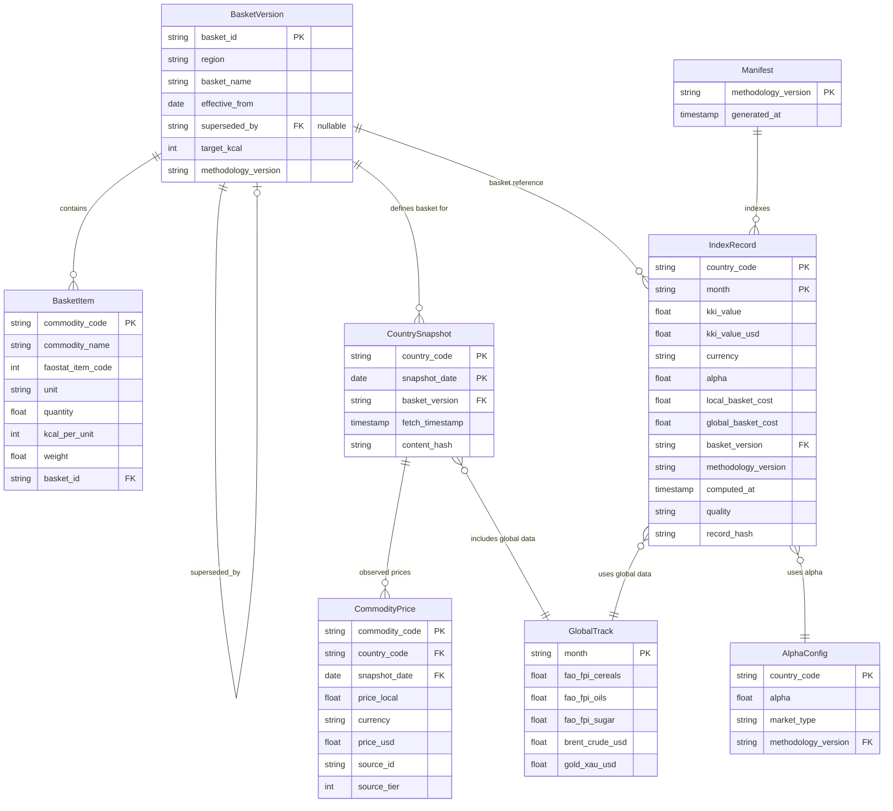
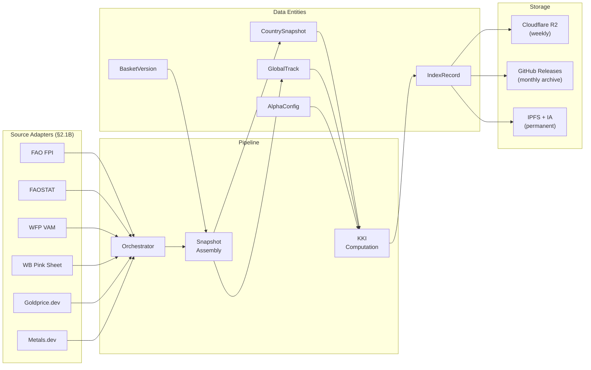

# KKI Data Schema

> **Task:** §2.2B of [`masterTODO.md`](../../../docs/masterTODO.md)
> **Status:** ✅ Complete
> **Date:** 2026-05-11
> **Authored by:** Data-modeler pass per §2.2B prompt; STOA loop run.
> **Depends on:**
> - [`khobz-index/docs/architecture/stack.md`](./stack.md) (§2.1B — adapter types, storage layout, Zod validation)
> - [`docs/kki/kki_research.md`](../../../docs/kki/kki_research.md) (§3 basket composition + formula, §4 versioning rules)
> - [`docs/project/moscow-prioritization.md`](../../../docs/project/moscow-prioritization.md) (M17, M27 — what the Karama app consumes)

---

## TL;DR

- **Three core entities:** BasketVersion (immutable basket definition), CountrySnapshot (weekly price observations), IndexRecord (computed KKI value per country per month).
- **Commodity identification:** FAO CPC codes (internationally standardized) as primary keys, with FAOSTAT item codes as pipeline cross-references.
- **Immutability rule:** Published data is never overwritten. Schema evolution creates new versions; old records reference the methodology version they were computed under.
- **Dual-publish:** Every data file ships as JSON (machine-readable, nested) + CSV (flat, researcher-friendly) under `data/{version}/{country_code}/{YYYY-MM}.*`.
- **Integrity:** SHA-256 content hashes on every snapshot and index record; manifest file includes per-file hashes for bulk verification.
- **Validation:** Zod 3.x schemas at every boundary — adapter output, snapshot assembly, index computation, and file serialization.

---

## 1. Basket Version Schema

A basket version defines the composition of a regional subsistence basket. Baskets are **immutable once published** — any change to composition, weights, or caloric targets produces a new version. Multiple basket versions coexist (different regions may evolve at different rates).

### 1.1 Entity Shape

```typescript
// khobz-index/src/shared/schema.ts

import { z } from "zod";

export const RegionSchema = z.enum([
  "mena",
  "south_asia",
  "east_southern_africa",
  "west_africa",
  "east_asia",
  "latin_america",
  "oecd",
]);

export type Region = z.infer<typeof RegionSchema>;

export const BasketItemSchema = z.object({
  commodity_code: z.string().min(3),
  commodity_name: z.string().min(1),
  faostat_item_code: z.number().int().positive(),
  unit: z.enum(["kg", "L", "ct"]),
  quantity: z.number().positive(),
  kcal_per_unit: z.number().positive(),
  weight: z.number().min(0).max(1),
});

export type BasketItem = z.infer<typeof BasketItemSchema>;

export const BasketVersionSchema = z.object({
  basket_id: z.string().min(1),
  region: RegionSchema,
  basket_name: z.string().min(1),
  effective_from: z.string().regex(/^\d{4}-\d{2}-\d{2}$/),
  superseded_by: z.string().nullable(),
  items: z.array(BasketItemSchema).min(3).max(8),
  target_kcal: z.number().int().min(14000).max(17000),
  methodology_version: z.string().regex(/^\d+\.\d+\.\d+$/),
}).refine(
  (basket) => {
    const sum = basket.items.reduce((s, item) => s + item.weight, 0);
    return Math.abs(sum - 1.0) < 0.001;
  },
  { message: "Item weights must sum to 1.0" }
);

export type BasketVersion = z.infer<typeof BasketVersionSchema>;
```

### 1.2 Commodity Code Reference

Commodity codes use the UN Central Product Classification (CPC) as primary identifiers, with FAOSTAT item codes as cross-references for pipeline source compatibility. Codes for KKI v1.0 basket items:

| Commodity | CPC code | FAOSTAT item code | Used in baskets |
|---|---|---|---|
| Wheat flour | 23112 | 16 | MENA, South Asia, Latin America, OECD |
| Rice, milled | 23161 | 31 | South Asia, West Africa, East Asia |
| Maize meal / flour | 23120 | 58 | East/Southern Africa, Latin America |
| Lentils, dry | 01342 | 186 | MENA, South Asia |
| Chickpeas, dry | 01341 | 191 | MENA (alternate to lentils) |
| Dried beans | 01310 | 176 | East/Southern Africa, Latin America, East Asia |
| Sugar, refined | 23511 | 2543 | MENA, East/Southern Africa, East Asia, Latin America, OECD |
| Cooking oil (sunflower) | 21531 | 268 | MENA, East/Southern Africa, East Asia, Latin America |
| Palm oil | 21491 | 257 | West Africa |
| Soybean oil | 21521 | 236 | South Asia (alternate) |
| Edible oil (generic) | 2153 | 2571 | South Asia, OECD |
| Cassava / yam | 01520 | 125 | West Africa |
| Dried fish | 04120 | 1579 | West Africa |
| Wheat bread | 23413 | 2905 | OECD |
| Dairy, milk | 02211 | 882 | OECD |
| Eggs | 02310 | 1062 | OECD |
| Soy / soybeans | 01441 | 236 | East Asia |

### 1.3 v1.0 Basket Definitions (JSON)

```json
{
  "basket_id": "mena-v1.0",
  "region": "mena",
  "basket_name": "Khobz basket",
  "effective_from": "2026-01-01",
  "superseded_by": null,
  "items": [
    {
      "commodity_code": "23112",
      "commodity_name": "Wheat flour",
      "faostat_item_code": 16,
      "unit": "kg",
      "quantity": 1.0,
      "kcal_per_unit": 3640,
      "weight": 0.30
    },
    {
      "commodity_code": "21531",
      "commodity_name": "Cooking oil",
      "faostat_item_code": 268,
      "unit": "L",
      "quantity": 1.0,
      "kcal_per_unit": 8840,
      "weight": 0.25
    },
    {
      "commodity_code": "23511",
      "commodity_name": "Sugar, refined",
      "faostat_item_code": 2543,
      "unit": "kg",
      "quantity": 1.0,
      "kcal_per_unit": 3870,
      "weight": 0.15
    },
    {
      "commodity_code": "01342",
      "commodity_name": "Pulses (lentils/chickpeas)",
      "faostat_item_code": 186,
      "unit": "kg",
      "quantity": 1.0,
      "kcal_per_unit": 3530,
      "weight": 0.30
    }
  ],
  "target_kcal": 15400,
  "methodology_version": "1.0.0"
}
```

The remaining six regional baskets (South Asia / Atta, East/Southern Africa / Sadza, West Africa / Riz, East Asia / Mihan, Latin America / Tortilla, OECD / Loaf) follow the same schema with region-appropriate commodities per [`kki_research.md` §3.3](../../../docs/kki/kki_research.md). All target ~15,100–15,500 kcal and weights summing to 1.0.

**Canonical on-disk baskets (v1.0):** [`data/baskets/`](../data/baskets/) contains `{region}-v1.0.json` for all seven regions. The MENA file matches this section’s example JSON. Other regions use the same CPC and FAOSTAT codes as §1.2; **`weight` per line item is proportional to `quantity × kcal_per_unit`**, normalized so weights sum to 1.0 (±0.001). **`kcal_per_unit` values are v1.0 methodological anchors** (literature-aligned round numbers); MINOR basket bumps may adjust them without changing commodity identity.

---

## 2. Country Snapshot Schema

A country snapshot captures the raw price observations for a single country on a single pipeline run. Snapshots are the intermediate data layer between adapter output (`PriceRecord` from [`stack.md` §2.1](./stack.md)) and the computed index record.

### 2.1 Entity Shape

```typescript
export const CommodityPriceSchema = z.object({
  commodity_code: z.string().min(3),
  commodity_name: z.string().min(1),
  price_local: z.number().positive(),
  currency: z.string().length(3),
  price_usd: z.number().positive(),
  source_id: z.string().min(1),
  source_tier: z.union([z.literal(1), z.literal(2), z.literal(3)]),
});

export type CommodityPrice = z.infer<typeof CommodityPriceSchema>;

export const GlobalTrackSchema = z.object({
  fao_fpi_cereals: z.number().positive().nullable(),
  fao_fpi_oils: z.number().positive().nullable(),
  fao_fpi_sugar: z.number().positive().nullable(),
  brent_crude_usd: z.number().positive().nullable(),
  gold_xau_usd: z.number().positive().nullable(),
  source_ids: z.array(z.string()),
});

export type GlobalTrack = z.infer<typeof GlobalTrackSchema>;

export const QualityFlagsSchema = z.object({
  missing_sources: z.array(z.string()).default([]),
  interpolated: z.array(z.string()).default([]),
  stale_gold: z.boolean().default(false),
  gold_stale_since: z.string().datetime().nullable().default(null),
  global_only: z.boolean().default(false),
});

export type QualityFlags = z.infer<typeof QualityFlagsSchema>;

export const CountrySnapshotSchema = z.object({
  country_code: z.string().length(2),
  snapshot_date: z.string().regex(/^\d{4}-\d{2}-\d{2}$/),
  basket_version: z.string().min(1),
  prices: z.array(CommodityPriceSchema),
  global_track: GlobalTrackSchema,
  fetch_timestamp: z.string().datetime(),
  quality_flags: QualityFlagsSchema,
  content_hash: z.string().regex(/^[a-f0-9]{64}$/),
});

export type CountrySnapshot = z.infer<typeof CountrySnapshotSchema>;
```

### 2.2 Snapshot Assembly Rules

1. **One snapshot per country per pipeline run.** The orchestrator merges all adapter results for a given country into a single snapshot.
2. **Best-source-wins per commodity.** If multiple sources return a price for the same commodity, the pipeline picks the highest-tier source. Ties broken by freshest `fetched_at`.
3. **Global track is country-independent.** The `global_track` object is computed once per pipeline run and embedded in every country snapshot for self-containedness.
4. **Quality flags are set by the orchestrator**, not by individual adapters. The flag rules:
   - `missing_sources`: list of `source_id` values that failed or returned no data for this country.
   - `interpolated`: list of `commodity_code` values where the price was carried forward from a previous snapshot (source had no new data).
   - `stale_gold`: true if all three gold sources failed; `gold_stale_since` records when the cached value was originally fetched.
   - `global_only`: true if no local-market source succeeded for this country (alpha forced to 0.0).
5. **Content hash** is SHA-256 of the JSON-serialized `prices` + `global_track` arrays, sorted by `commodity_code` for deterministic ordering. Used for staleness detection and integrity verification.

### 2.3 Example Snapshot (JSON)

```json
{
  "country_code": "MA",
  "snapshot_date": "2026-05-05",
  "basket_version": "mena-v1.0",
  "prices": [
    {
      "commodity_code": "23112",
      "commodity_name": "Wheat flour",
      "price_local": 7.50,
      "currency": "MAD",
      "price_usd": 0.74,
      "source_id": "faostat",
      "source_tier": 1
    },
    {
      "commodity_code": "21531",
      "commodity_name": "Cooking oil",
      "price_local": 18.00,
      "currency": "MAD",
      "price_usd": 1.78,
      "source_id": "faostat",
      "source_tier": 1
    },
    {
      "commodity_code": "23511",
      "commodity_name": "Sugar, refined",
      "price_local": 8.20,
      "currency": "MAD",
      "price_usd": 0.81,
      "source_id": "faostat",
      "source_tier": 1
    },
    {
      "commodity_code": "01342",
      "commodity_name": "Pulses (lentils/chickpeas)",
      "price_local": 22.00,
      "currency": "MAD",
      "price_usd": 2.17,
      "source_id": "faostat",
      "source_tier": 1
    }
  ],
  "global_track": {
    "fao_fpi_cereals": 128.4,
    "fao_fpi_oils": 145.2,
    "fao_fpi_sugar": 112.8,
    "brent_crude_usd": 78.50,
    "gold_xau_usd": 2340.00,
    "source_ids": ["fao-fpi", "wb-pink-sheet", "goldprice-dev"]
  },
  "fetch_timestamp": "2026-05-05T06:12:34.567Z",
  "quality_flags": {
    "missing_sources": [],
    "interpolated": [],
    "stale_gold": false,
    "gold_stale_since": null,
    "global_only": false
  },
  "content_hash": "a1b2c3d4e5f67890abcdef1234567890abcdef1234567890abcdef1234567890"
}
```

---

## 3. Index Record Schema

An index record is the computed KKI value for a single country in a single month. This is the entity the Karama app consumes via M17/M27, and the entity researchers read from the static archive.

### 3.1 Entity Shape

```typescript
export const SourceContributionSchema = z.object({
  slot: z.enum([
    "global_cereals_oils_sugar",
    "local_market_prices",
    "gold_spot",
    "crude_oil_energy",
  ]),
  source_ids: z.array(z.string()),
  tiers: z.array(z.union([z.literal(1), z.literal(2), z.literal(3)])),
});

export type SourceContribution = z.infer<typeof SourceContributionSchema>;

export const QualityLevelSchema = z.enum(["full", "degraded", "global_only"]);

export type QualityLevel = z.infer<typeof QualityLevelSchema>;

export const IndexRecordSchema = z.object({
  country_code: z.string().length(2),
  month: z.string().regex(/^\d{4}-\d{2}$/),
  kki_value: z.number().positive(),
  kki_value_usd: z.number().positive(),
  currency: z.string().length(3),
  alpha: z.number().min(0).max(1),
  local_basket_cost: z.number().nonnegative(),
  global_basket_cost: z.number().positive(),
  basket_version: z.string().min(1),
  methodology_version: z.string().regex(/^\d+\.\d+\.\d+$/),
  computed_at: z.string().datetime(),
  source_summary: z.array(SourceContributionSchema),
  quality: QualityLevelSchema,
  record_hash: z.string().regex(/^[a-f0-9]{64}$/),
});

export type IndexRecord = z.infer<typeof IndexRecordSchema>;
```

### 3.2 Computation Rules

1. **Monthly aggregation.** When the pipeline runs weekly, a month's KKI is recomputed from the latest snapshot data available for that month. Only the final computation of the month (last Monday) is archived. Weekly intermediate values are served via R2/KV for the Karama app but not committed to the static archive.
2. **Formula application.** Per [`kki_research.md` §3.2](../../../docs/kki/kki_research.md):
   ```
   kki_value = alpha * local_basket_cost + (1 - alpha) * global_basket_cost
   ```
   Where `local_basket_cost` is the weighted sum of local commodity prices using the basket weights, and `global_basket_cost` is the composite of FAO FPI sub-indices + Brent + XAU converted to local currency.
3. **Alpha selection.** Per-country alpha values are stored in a configuration table (see §3.3 below). The alpha used is recorded on every index record for reproducibility.
4. **USD conversion.** `kki_value_usd` is computed by dividing `kki_value` by the prevailing FX rate (display-only; not an index input). If FX is unavailable, `kki_value_usd` uses the last-cached rate and the record is flagged `degraded`.
5. **Quality determination:**
   - `full`: all data slots had at least one source; no interpolation or staleness.
   - `degraded`: one or more quality flags active (stale gold, interpolated commodity, missing one source but another succeeded).
   - `global_only`: no local-market source available; alpha forced to 0.0.
6. **Record hash** is SHA-256 of the JSON-serialized record excluding the `record_hash` field itself and `computed_at` (which varies by run timing). This enables consumers to verify integrity without depending on computation timing.

### 3.3 Alpha Configuration Table

Per-country alpha values per [`kki_research.md` §3.2](../../../docs/kki/kki_research.md):

```typescript
export const AlphaConfigSchema = z.record(
  z.string().length(2),
  z.object({
    alpha: z.number().min(0).max(1),
    market_type: z.enum([
      "high_trust",
      "standard",
      "subsidy_heavy",
      "low_trust",
      "no_local_data",
    ]),
    rationale: z.string().optional(),
  })
);

export type AlphaConfig = z.infer<typeof AlphaConfigSchema>;
```

Default alpha values by market type:

| Market type | Alpha | Example countries |
|---|---|---|
| `high_trust` | 0.80 | FR, US, DE |
| `standard` | 0.65 | MA, KE, TR |
| `subsidy_heavy` | 0.50 | EG, DZ, TN |
| `low_trust` | 0.35 | LB, SS, CF |
| `no_local_data` | 0.00 | Fallback when all local sources fail |

The alpha configuration file lives at `data/{version}/alpha-config.json` and is versioned alongside the methodology.

The shipped **`v1.0`** file is [`data/v1.0/alpha-config.json`](../data/v1.0/alpha-config.json): one object per ISO 3166-1 alpha-2 country in [`src/shared/countries.ts`](../src/shared/countries.ts) (`COUNTRY_TO_REGION`). Default row is **`market_type`: `standard`**, **`alpha`: 0.65**; the example countries named in the table above use **`rationale`** and the matching **`alpha`** / **`market_type`**. **`no_local_data`** is enforced at computation time when local adapters fail entirely (not persisted as every country’s static default).

### 3.4 Example Index Record (JSON)

```json
{
  "country_code": "MA",
  "month": "2026-04",
  "kki_value": 9.345,
  "kki_value_usd": 0.923,
  "currency": "MAD",
  "alpha": 0.65,
  "local_basket_cost": 9.10,
  "global_basket_cost": 9.80,
  "basket_version": "mena-v1.0",
  "methodology_version": "1.0.0",
  "computed_at": "2026-05-05T06:15:22.123Z",
  "source_summary": [
    {
      "slot": "global_cereals_oils_sugar",
      "source_ids": ["fao-fpi"],
      "tiers": [1]
    },
    {
      "slot": "local_market_prices",
      "source_ids": ["faostat"],
      "tiers": [1]
    },
    {
      "slot": "gold_spot",
      "source_ids": ["goldprice-dev"],
      "tiers": [3]
    },
    {
      "slot": "crude_oil_energy",
      "source_ids": ["wb-pink-sheet"],
      "tiers": [1]
    }
  ],
  "quality": "full",
  "record_hash": "f0e1d2c3b4a5968778695a4b3c2d1e0f1234567890abcdef1234567890abcdef"
}
```

---

## 4. Versioning Strategy

### 4.1 Methodology Versioning (semver)

The `methodology_version` field on every index record follows strict semantic versioning:

| Change type | Version bump | Examples |
|---|---|---|
| **MAJOR** | Breaking change to formula, basket recomposition, or default alpha change | Formula rewrite; replacing hybrid weighting with chain-weighted Paasche; adding/removing a basket item; changing default alpha from 0.65 to 0.60 |
| **MINOR** | Additive, non-breaking | New country added; new source adapter added; per-country alpha tuning; additional quality flag |
| **PATCH** | Bug fix, no output change at published precision | Rounding correction; computation optimization with identical results; documentation fix |

### 4.2 Basket Versioning

Baskets are versioned independently from the methodology. A basket ID follows the pattern `{region}-v{X.Y}`:

- **Major bump** (`mena-v2.0`): commodity added or removed, weight redistribution, caloric target change.
- **Minor bump** (`mena-v1.1`): commodity code update (e.g., FAO reclassification), unit standardization, kcal_per_unit correction.

The `superseded_by` field on a basket version points to the replacement, forming a linked list. Old baskets are never deleted — they remain in the archive for historical record reference.

### 4.3 Immutability Rules

These rules are binding and enforced at the pipeline level:

1. **Published index records are never overwritten.** A record computed under methodology `1.0.0` with basket `mena-v1.0` for `MA/2026-04` stays exactly as published, even if methodology `1.1.0` would produce a different value.
2. **Published snapshots are never overwritten.** The price observations that fed a published index record are preserved as-is.
3. **Basket definitions are never mutated.** Changes produce a new version with a new `basket_id`.
4. **The `methodology_version` on a record is the version active at computation time**, not the latest version. Consumers must handle multiple methodology versions when reading historical data.
5. **Corrections** to a published record are handled by publishing a `correction` record with a reference to the original `record_hash` and the corrected values. Corrections are additive, not destructive. (Reserved for PATCH-level bugs; not yet implemented in v1.0.0.)

### 4.4 Version Transition Protocol

When the methodology version bumps:

1. **PATCH bump:** Pipeline silently adopts the new version. Next computation uses the new patch. No special handling needed — output should be identical at published precision.
2. **MINOR bump:** Pipeline adopts the new version. New countries or sources appear in the next computation. Existing records are unaffected. Manifest updated.
3. **MAJOR bump:**
   a. New methodology version directory created: `data/v2.0/`.
   b. New basket versions created if composition changed.
   c. Previous version's data remains at `data/v1.0/` — permanently frozen.
   d. The Karama app's `kki_rate_cache` table (from [`data-model.md` §3.13](../../../docs/architecture/data-model.md)) records which methodology version a promise was anchored to. Settlement always looks up the anchor-time methodology version, not the latest.
   e. Both versions may be computed in parallel during a transition month to validate the new methodology against the old.

---

## 5. Storage Format

### 5.1 Dual-Publish Convention

Every data file is published in two formats:

| Format | Purpose | Structure | Consumers |
|---|---|---|---|
| **JSON** | Machine-readable, nested, self-describing | Full entity with metadata | Karama app, KKI API, programmatic consumers |
| **CSV** | Researcher-friendly, flat, importable | One row per record, denormalized | Journalists, researchers, spreadsheet users |

### 5.2 File Naming Convention

```
data/
├── v1.0/                                   # methodology major.minor version
│   ├── baskets.json                        # all basket definitions for this version
│   ├── alpha-config.json                   # per-country alpha configuration
│   ├── manifest.json                       # index of all available data
│   ├── global/
│   │   ├── 2026-04.json                    # global track values for the month
│   │   └── 2026-04.csv
│   ├── MA/
│   │   ├── 2026-04.json                    # index record + embedded snapshot
│   │   ├── 2026-04.csv                     # flat index record
│   │   ├── 2026-03.json
│   │   └── 2026-03.csv
│   ├── EG/
│   │   ├── 2026-04.json
│   │   └── 2026-04.csv
│   └── ...
└── v2.0/                                   # future major version (independent)
    ├── baskets.json
    └── ...
```

**Path pattern:** `data/{version}/{country_code}/{YYYY-MM}.json` and `data/{version}/{country_code}/{YYYY-MM}.csv`

- `{version}`: methodology version in `vMAJOR.MINOR` format (PATCH is omitted from the path since patches don't change output structure).
- `{country_code}`: ISO 3166-1 alpha-2 uppercase, or `global` for the global track.
- `{YYYY-MM}`: year-month of the index period.

### 5.3 JSON File Structure (per-country)

The per-country JSON file contains the index record with the snapshot embedded for self-containedness:

```json
{
  "schema_version": "1.0",
  "index_record": {
    "country_code": "MA",
    "month": "2026-04",
    "kki_value": 9.345,
    "kki_value_usd": 0.923,
    "currency": "MAD",
    "alpha": 0.65,
    "local_basket_cost": 9.10,
    "global_basket_cost": 9.80,
    "basket_version": "mena-v1.0",
    "methodology_version": "1.0.0",
    "computed_at": "2026-05-05T06:15:22.123Z",
    "source_summary": [ "..." ],
    "quality": "full",
    "record_hash": "f0e1d2c3..."
  },
  "snapshot": {
    "snapshot_date": "2026-05-05",
    "prices": [ "..." ],
    "global_track": { "..." },
    "fetch_timestamp": "2026-05-05T06:12:34.567Z",
    "quality_flags": { "..." },
    "content_hash": "a1b2c3d4..."
  }
}
```

### 5.4 CSV Column Layout (per-country)

Flat, one-row-per-month format for researcher import:

| Column | Type | Description |
|---|---|---|
| `country_code` | string | ISO 3166-1 alpha-2 |
| `month` | string | YYYY-MM |
| `kki_value` | number | Local-currency cost of 1 KK |
| `kki_value_usd` | number | USD-equivalent |
| `currency` | string | ISO 4217 currency code |
| `alpha` | number | Hybrid weighting factor used |
| `local_basket_cost` | number | Weighted local basket price |
| `global_basket_cost` | number | Global track composite in local currency |
| `basket_version` | string | Basket ID reference |
| `methodology_version` | string | Semver |
| `computed_at` | string | ISO 8601 |
| `quality` | string | full / degraded / global_only |
| `fao_fpi_cereals` | number | FAO FPI cereals sub-index |
| `fao_fpi_oils` | number | FAO FPI oils sub-index |
| `fao_fpi_sugar` | number | FAO FPI sugar sub-index |
| `brent_crude_usd` | number | Brent crude price (USD/barrel) |
| `gold_xau_usd` | number | Gold spot (USD/oz) |
| `record_hash` | string | SHA-256 integrity hash |

### 5.5 Global Track File

The global track file (`data/{version}/global/{YYYY-MM}.json`) contains the shared global commodity data that is identical across all countries:

```json
{
  "schema_version": "1.0",
  "month": "2026-04",
  "methodology_version": "1.0.0",
  "global_track": {
    "fao_fpi_cereals": 128.4,
    "fao_fpi_oils": 145.2,
    "fao_fpi_sugar": 112.8,
    "brent_crude_usd": 78.50,
    "gold_xau_usd": 2340.00,
    "source_ids": ["fao-fpi", "wb-pink-sheet", "goldprice-dev"]
  },
  "computed_at": "2026-05-05T06:15:22.123Z",
  "content_hash": "b2c3d4e5f67890abcdef1234567890abcdef1234567890abcdef1234567890ab"
}
```

### 5.6 Manifest File

The manifest (`data/{version}/manifest.json`) provides a complete index of available data, enabling bulk validation and discovery:

```json
{
  "schema_version": "1.0",
  "methodology_version": "1.0.0",
  "generated_at": "2026-05-05T06:20:00.000Z",
  "baskets": ["mena-v1.0", "south_asia-v1.0", "east_southern_africa-v1.0",
              "west_africa-v1.0", "east_asia-v1.0", "latin_america-v1.0", "oecd-v1.0"],
  "countries": [
    {
      "country_code": "MA",
      "basket_version": "mena-v1.0",
      "alpha": 0.65,
      "months_available": ["2026-01", "2026-02", "2026-03", "2026-04"],
      "latest_month": "2026-04",
      "latest_quality": "full"
    }
  ],
  "file_hashes": {
    "MA/2026-04.json": "sha256:f0e1d2c3b4a5...",
    "MA/2026-04.csv": "sha256:a9b8c7d6e5f4...",
    "global/2026-04.json": "sha256:b2c3d4e5f678..."
  }
}
```

**Implementation mapping (§3.4B):** Zod `SnapshotManifestSchema` + `persistCountryMonth` / `reader` helpers live under [`../../src/storage/`](../../src/storage/) (`writer.ts`, `manifest.ts`, `history.ts`, `integrity.ts`, `bundle.ts`). R2 object keys omit the `data/` prefix per [`architecture.md`](./architecture.md) §3.1 while mirroring `{version}/{CC}/{YYYY-MM}.*`.

---


## 6. Entity Relationship Diagram



### 6.1 Relationship Summary

| From | To | Cardinality | Description |
|---|---|---|---|
| BasketVersion | BasketItem | 1:N | A basket contains 3-8 commodity items |
| BasketVersion | BasketVersion | 1:0..1 | Self-referential supersession chain |
| BasketVersion | CountrySnapshot | 1:N | Snapshots reference which basket they price |
| BasketVersion | IndexRecord | 1:N | Index records reference their computation basket |
| CountrySnapshot | CommodityPrice | 1:N | A snapshot contains one price per basket commodity |
| GlobalTrack | CountrySnapshot | 1:N | Same global track embedded in all country snapshots for a given month |
| GlobalTrack | IndexRecord | 1:N | Index formula uses the global track |
| AlphaConfig | IndexRecord | 1:N | Per-country alpha used in computation |

### 6.2 Data Flow



---

## 7. STOA Loop

### 7.1 Context

- §2.1B ratified the split architecture (GH Actions + Bun pipeline, CF Workers + Hono API serving) and defined the adapter interface with `PriceRecord`, `SourceAdapter`, and `AdapterResult` types.
- §1.5.0 established the KKI v1.0 specification: hybrid weighting formula, 7 regional baskets, caloric invariant, and the "never retroactive recalculation" rule.
- §1.5.2 bootstrapped the `khobz-index` repo with governance and methodology docs.
- The Karama app consumes KKI via M17 (anchor at recording) and M27 (in-app KK display), using Supabase-JWT exchange to authenticate against the closed API.

### 7.2 Impact

This document directly feeds:

| Downstream task | What it consumes from this doc |
|---|---|
| §2.3B KKI API Contract | Entity shapes (index record, basket version); file naming convention for static archive endpoints — [`api-contract.md`](./api-contract.md), [`openapi.yaml`](./openapi.yaml) |
| §3.2B Source Adapters | Commodity code reference table (CPC → FAOSTAT mapping) |
| §3.3B Calculation Engine | Index record schema, alpha config, computation rules, global track shape |
| §3.4B Snapshot Storage | **✅ 2026-05-11** File naming convention, manifest schema, dual-publish format, content hashing — implemented in [`../../src/storage/`](../../src/storage/). |
| §3.6B Static Data Archive | **✅ 2026-05-11** — [`../../src/archive/`](../../src/archive/) (+ [`../../data/README.md`](../../data/README.md)) |
| Karama app `kki_rate_cache` | IndexRecord shape maps to `kki_rate_cache` columns (country_code, month, kki_value, methodology_version) |

### 7.3 Risks

| # | Risk | Severity | Likelihood | Mitigation |
|---|---|---|---|---|
| **D1** | **Schema evolution: basket composition changes mid-year** | Medium | Low (annual review cycle per kki_research.md Q-K1) | New basket version created with new `basket_id`. Old records reference old basket. Transition month may produce records under both old and new basket versions. Both coexist in the archive — no overwrite. Manifest `baskets` array lists all active versions. |
| **D2** | **Data integrity: corrupted or tampered files in archive** | Medium | Low | SHA-256 hashes on every snapshot (`content_hash`) and index record (`record_hash`). Manifest includes per-file hashes. Consumers verify `file_hashes` on download. Pipeline rejects records that fail hash verification on read-back. IPFS content-addressing provides a second integrity layer. |
| **D3** | **Backward compatibility: consumers reading old methodology versions** | Medium | Medium (multiple versions will coexist by year 2) | Version-prefixed file paths (`data/v1.0/`, `data/v2.0/`) guarantee old data is always reachable. JSON files include `schema_version` for format evolution. Karama app stores `methodology_version` on each promise anchor — settlement always looks up the correct version directory. |
| **D4** | **FAO CPC code reclassification** | Low | Low (CPC revisions happen on ~10-year cycles) | Basket version minor bump (e.g., `mena-v1.1`) absorbs code changes without affecting index computation. Old basket versions retain old codes. Cross-reference table in §1.2 is the single source of truth for code mapping. |
| **D5** | **CSV format ambiguity (floating-point precision, locale-dependent decimal separators)** | Low | Medium | CSV uses period as decimal separator (POSIX locale). Floating-point values rounded to 3 decimal places. Header row always present. UTF-8 encoding. No BOM. These conventions are documented in §5.4 and enforced by the CSV serializer. |
| **D6** | **Manifest staleness after failed pipeline run** | Low | Low | Manifest is regenerated on every successful pipeline run, not incrementally appended. A failed run does not modify the manifest. The `generated_at` timestamp allows consumers to detect staleness. |

### 7.4 Verify DoD

Per §2.2B DoD checklist in [`masterTODO.md`](../../../docs/masterTODO.md):

- [x] **Basket version schema: commodity, kcal_per_kg, weight, region assignment** — §1: `BasketVersionSchema` + `BasketItemSchema` with commodity codes, kcal_per_unit, weight (summing to 1.0), region enum. v1.0 basket definitions with FAO CPC + FAOSTAT cross-references.
- [x] **Country snapshot schema: country_code, date, commodity prices, source_tier, fetch_timestamp** — §2: `CountrySnapshotSchema` with `CommodityPriceSchema` (source_id, source_tier), `GlobalTrackSchema`, `QualityFlagsSchema`, fetch_timestamp, content_hash.
- [x] **Index record schema: country_code, month, kki_value, alpha, basket_version, methodology_version** — §3: `IndexRecordSchema` with all specified fields plus kki_value_usd, source_summary, quality level, record_hash.
- [x] **Versioning strategy for methodology changes (KKI v1.0 → v1.1 etc.)** — §4: semver rules (MAJOR/MINOR/PATCH), basket independent versioning, immutability rules, version transition protocol.
- [x] **Storage format decided: JSON + CSV dual-publish** — §5: file naming convention, JSON structure (nested with embedded snapshot), CSV column layout (flat), global track file, manifest with per-file hashes.

---

## Cross-references

- KKI stack & source adapters: [`khobz-index/docs/architecture/stack.md`](./stack.md)
- KKI methodology (public): [`khobz-index/docs/methodology.md`](../methodology.md)
- KKI research (canonical): [`docs/kki/kki_research.md`](../../../docs/kki/kki_research.md)
- Karama app data model: [`docs/architecture/data-model.md`](../../../docs/architecture/data-model.md) (§3.13 `kki_rate_cache`)
- MoSCoW (M17, M27): [`docs/project/moscow-prioritization.md`](../../../docs/project/moscow-prioritization.md)
- Master TODO: [`docs/masterTODO.md`](../../../docs/masterTODO.md) — §2.2B · §2.4B [`architecture.md`](./architecture.md)

---

*End of §2.2B KKI Data Schema. Next: §2.4B full platform architecture is [`architecture.md`](./architecture.md); API surface is §2.3B [`api-contract.md`](./api-contract.md) + [`openapi.yaml`](./openapi.yaml).*
