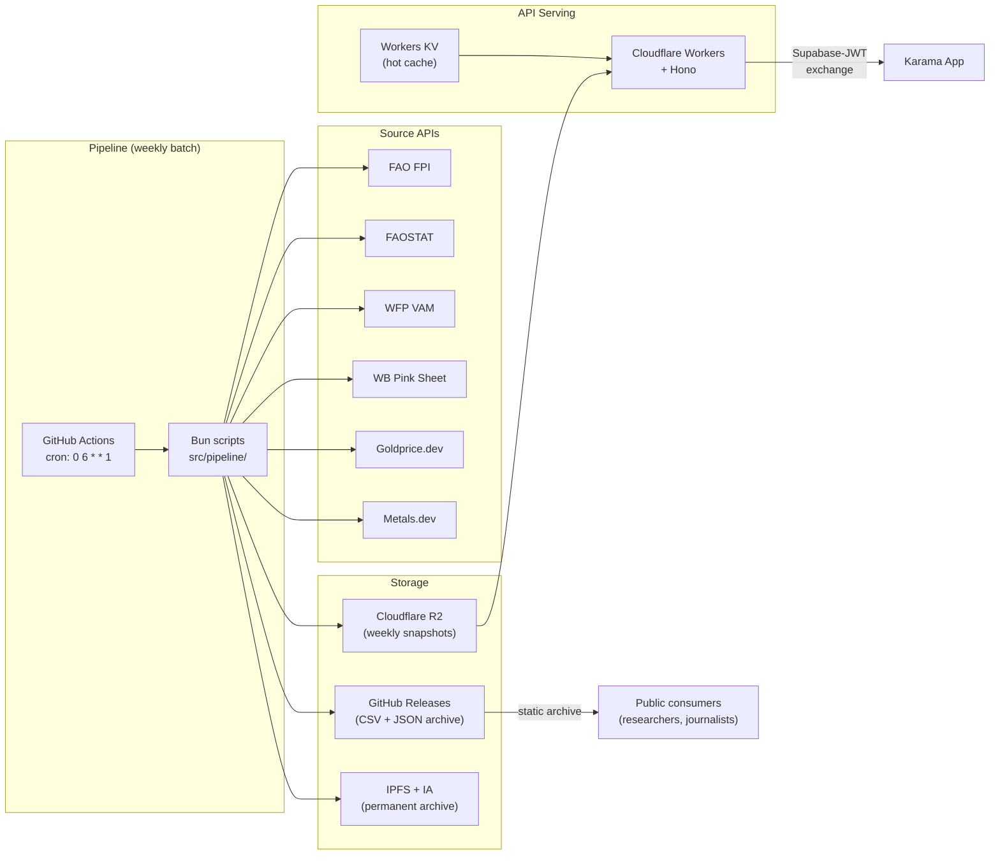
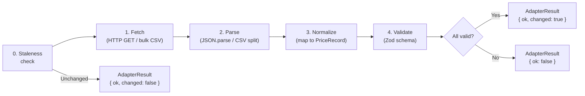
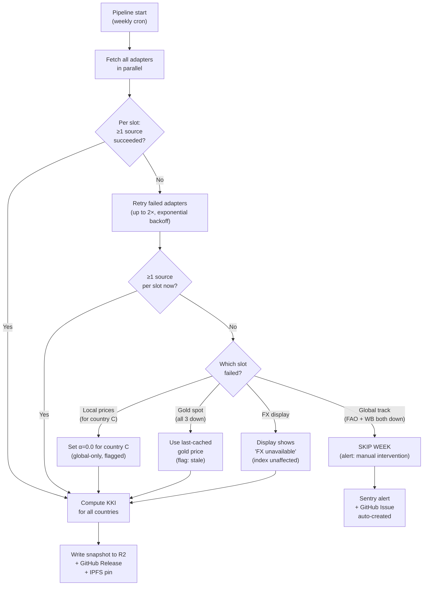

# KKI Stack & Source Adapters

> **Task:** §2.1B of [`masterTODO.md`](../../../docs/masterTODO.md)
> **Status:** ✅ Complete
> **Date:** 2026-05-10
> **Authored by:** Data-pipeline-architect pass per §2.1B prompt; STOA loop run.
> **Depends on:**
> - [`docs/kki/kki_research.md`](../../../docs/kki/kki_research.md) (§4 source reliability tiers, §7 architecture)
> - [`docs/project/moscow-prioritization.md`](../../../docs/project/moscow-prioritization.md) (M17 re-scoped to KKI anchor)
> - [`docs/strategy/feasibility-validation.md`](../../../docs/strategy/feasibility-validation.md) (cost ceiling §4.3, R4 resolution)
> - [`docs/architecture/tech-stack.md`](../../../docs/architecture/tech-stack.md) (§2.1A — Karama app stack, R9 defaults)
> - [`khobz-index/docs/methodology.md`](../methodology.md) (KKI v1.0 formula, basket definitions, data sources)

---

## TL;DR

- **Pipeline compute:** GitHub Actions (weekly cron) running Bun scripts — $0 at MVP (private repo: 2,000 free min/mo; pipeline uses ~12 min/mo = 0.6% of quota), no CPU time limits, natural integration with GitHub Releases for the static data archive. Becomes unlimited when the repo goes public at launch.
- **API serving:** Cloudflare Workers + Hono — serves pre-computed KKI data from R2/KV to the Karama app via Supabase-JWT exchange. Free tier is sufficient (read + JSON response < 10ms CPU).
- **Storage:** Cloudflare R2 (weekly snapshots for API) + GitHub Releases (static archive: CSV + JSON) + IPFS + Internet Archive.
- **Adapter pattern:** Each source implements a `SourceAdapter` interface: fetch → parse → normalize to `PriceRecord` → Zod-validate → return typed `Result<T, AdapterError>`. Adapters are **freshness-aware**: they detect whether the upstream source has new data since the last fetch and short-circuit when nothing changed.
- **Cost:** $0 operational at MVP. All 6 source APIs are free. GH Actions free 2,000 min/mo (private repo at MVP; unlimited post-launch when public). Workers + R2 free tier covers serving. Weekly cadence (4 runs/mo) stays well within all quotas.
- **Redundancy:** Every data slot has ≥2 independent sources with explicit fallback order. No single-source price slot exists.
- **Freshness:** Pipeline runs weekly. Sources that update more frequently than monthly (gold spot, FX, WFP crisis-country prices) produce genuinely new data each week. Monthly sources (FAO FPI, FAOSTAT, WB Pink Sheet) are re-checked but short-circuit when unchanged. The KKI recomputes whenever **any** input changes — users always see the freshest index the data can support.

---

## 1. Runtime Selection

### 1.1 The Split-Architecture Decision

The KKI pipeline has two structurally different workloads:

1. **Weekly batch compute** — fetch 6+ API sources, parse responses (JSON/CSV, some multi-MB), validate, compute KKI for ~50 countries, write snapshots. Runs weekly (every Monday). Needs seconds-to-minutes of CPU. Freshness-aware: adapters skip unchanged sources.
2. **API serving** — read pre-computed data from R2/KV, return JSON to the Karama app. Runs on-demand. Needs <10ms CPU per request.

A single-runtime approach hits a constraint: **Cloudflare Workers free tier imposes 10ms CPU time per invocation**, including cron triggers. While `fetch()` calls (network I/O) don't count toward CPU, parsing multiple API responses and computing index values across 50 countries will exceed 10ms. The paid plan ($5/mo) lifts this to 15 minutes for hourly+ cron triggers, but breaks the §0.4 cost ceiling of $0 operational at MVP.

**Decision:** Split architecture.



### 1.2 Trade-Off Evaluation

| Criterion | GH Actions + Bun (pipeline) | CF Workers free (serving) | Deno Deploy free | Node on Railway/Fly |
|---|---|---|---|---|
| **Weekly cron** | Free (private: 2,000 min/mo; public: unlimited), 6hr job timeout, 2-core runner | 10ms CPU per cron — too tight for batch | 10 cron jobs, 15hr CPU/mo — sufficient | Requires paid plan ($5-7/mo) |
| **TypeScript-native** | Bun native TS execution (R9 default) | V8 isolate (TS via esbuild, not Bun runtime) | Deno native TS | Node + tsx or ts-node |
| **R2/KV access** | Via `wrangler` CLI or R2 S3-compatible API | Native bindings (fastest path) | No native R2; S3-compat API only | No native R2; S3-compat API only |
| **Cost at MVP** | $0 (private: 2,000 min/mo free; uses ~12 min weekly) | $0 (100K req/day free) | $0 (1M req/mo free) | ~$5-7/mo minimum |
| **Cold start** | N/A (batch job, ~2s runner boot) | <5ms (isolate model) | <50ms | 200-500ms (container boot) |
| **Ecosystem alignment** | Same Bun runtime as Karama backend (§2.1A) | Hono shared with Karama backend | Adds second runtime to project | Adds second runtime + vendor |

### 1.3 Rationale

**Pipeline compute: GitHub Actions + Bun**

- The `khobz-index` repo is **private until launch** (MIT + CC BY 4.0 once public). GitHub Actions Free plan includes **2,000 minutes/month for private repositories** — the weekly pipeline run uses ~12 minutes/month (4 runs × ~3 min), consuming 0.6% of the quota. Once the repo goes public at launch, Actions minutes become unlimited.
- A weekly cron (`0 6 * * 1` — every Monday at 06:00 UTC) gives a 6-hour job timeout per run. Monday timing ensures weekend data from real-time sources (gold, FX) is captured at market open, and WFP's weekly data drops (typically mid-week prior) are included.
- Bun runs TypeScript natively, honoring R9 defaults. The pipeline scripts live in the same repo as the methodology, enabling `bun test` to verify calculations.
- R2 uploads from GitHub Actions use the S3-compatible API with a service account credential (stored as a GitHub Actions secret). `wrangler r2 object put` is also available.
- GitHub Releases are created by the same workflow — natural integration for the static data archive.
- Manual re-run via `workflow_dispatch` serves as the escape hatch if the scheduled run fails.

**API serving: Cloudflare Workers + Hono**

- The Karama app's backend already runs on Cloudflare Workers + Hono (§2.1A). Using the same stack for the KKI closed API minimizes operational surface and shares deployment patterns (`wrangler`, R2 bindings, KV bindings).
- Serving pre-computed data from R2 or KV is a read + JSON serialize — well within the free tier's 10ms CPU limit.
- Free tier: 100,000 requests/day. At MVP (2,000 Karama users × ~4 KKI lookups/month = ~8,000 req/month) this is 0.3% of capacity.

**Why not Workers-only (cron + serving):**

The free tier's 10ms CPU limit per cron invocation is structurally insufficient for a multi-source fetch + parse + validate + compute + store pipeline. Even with network I/O excluded from CPU accounting, JSON parsing of multi-MB FAOSTAT/WFP responses + Zod validation + KKI computation for 50 countries will exceed 10ms. The paid plan ($5/mo) removes this constraint but violates §0.4's $0 operational target.

**Why not Deno Deploy:**

Deno Deploy's free tier (15hr CPU/mo, 10 cron jobs, 1M requests/mo) would be technically sufficient for both pipeline and serving. Rejected because: (a) breaks R9 (Bun is the default runtime); (b) no native R2 bindings — snapshots would need S3-compatible uploads, losing the binding-level integration the serving layer benefits from; (c) adds a second runtime ecosystem to the project (Deno APIs, `deno.json`, Deno-specific testing patterns) when the entire Karama stack is Bun-native.

**Why not Node on Railway/Fly:**

Railway and Fly.io both require paid plans for always-on processes. Even Fly.io's PAYG minimum is ~$3-5/mo for a persistent machine. Overkill and cost-positive for a pipeline that runs weekly and an API that serves <10K requests/month.

### 1.4 Pinned Versions and Tooling

| Component | Version | Purpose |
|---|---|---|
| Bun | 1.2.x (latest stable at build time) | Pipeline runtime, test runner, package manager |
| Hono | 4.12.x | API framework for Workers serving layer |
| Zod | 3.x | Schema validation at adapter boundaries |
| wrangler | latest | Workers + R2 deployment CLI |
| GitHub Actions runner | `ubuntu-latest` | Pipeline execution environment |
| `oven-sh/setup-bun` | v2 | Bun installation in GH Actions |

---

## 2. Adapter Interface

### 2.1 Core Types

Every source adapter implements the same contract. The pipeline orchestrator calls adapters in parallel, collects results, and proceeds to computation only if minimum-viable data is present (see §5 Redundancy Strategy).

```typescript
// khobz-index/src/adapters/types.ts

import { z } from "zod";

/** ISO 3166-1 alpha-2 country code */
export type CountryCode = string;

/** Unique identifier for a data source */
export type SourceId =
  | "fao-fpi"
  | "faostat"
  | "wfp-vam"
  | "wb-pink-sheet"
  | "goldprice-dev"
  | "metals-dev"
  | "frankfurter"
  | "eia-steo"
  | "exchangerate-host";

/** Reliability tier per kki_research.md §4.2 */
export type SourceTier = 1 | 2 | 3;

/** A single normalized price observation */
export const PriceRecordSchema = z.object({
  commodity: z.string(),
  price_usd: z.number().positive(),
  price_local: z.number().positive().optional(),
  currency: z.string().length(3).optional(),
  price_unit: z.string(),
  date: z.string().regex(/^\d{4}-\d{2}(-\d{2})?$/),
  source_id: z.string(),
  fetched_at: z.string().datetime(),
});

export type PriceRecord = z.infer<typeof PriceRecordSchema>;

/** Metadata about a successful fetch */
export interface FetchMetadata {
  source_id: SourceId;
  tier: SourceTier;
  response_time_ms: number;
  record_count: number;
  date_range: { from: string; to: string };
  cache_hit: boolean;
}

/** Structured error for a failed fetch */
export interface AdapterError {
  source_id: SourceId;
  code:
    | "NETWORK_ERROR"
    | "AUTH_FAILURE"
    | "RATE_LIMITED"
    | "PARSE_ERROR"
    | "VALIDATION_ERROR"
    | "NOT_FOUND"
    | "UPSTREAM_ERROR";
  message: string;
  retryable: boolean;
  timestamp: string;
}

/** Parameters passed to every adapter's fetch method */
export interface FetchParams {
  /** Target week start date in YYYY-MM-DD (Monday) or YYYY-MM for monthly-only sources */
  target_date: string;
  /** Country codes to fetch (adapter may ignore if source is global) */
  countries?: CountryCode[];
  /** Timeout in milliseconds */
  timeout_ms?: number;
  /** Previous fetch state — adapter uses this to detect staleness and short-circuit */
  previous?: FetchState;
}

/** Cached state from the last successful fetch, used for staleness detection */
export interface FetchState {
  /** Content hash (SHA-256 of normalized records) from last successful fetch */
  content_hash: string;
  /** ETag or Last-Modified header from last response (if source supports it) */
  etag?: string;
  last_modified?: string;
  /** Timestamp of last successful fetch */
  fetched_at: string;
  /** The records from last fetch (used as cache when source hasn't changed) */
  records: PriceRecord[];
}

/** Discriminated union result type — now includes UNCHANGED for skip-when-stale */
export type AdapterResult =
  | { ok: true; changed: true; records: PriceRecord[]; metadata: FetchMetadata }
  | { ok: true; changed: false; state: FetchState; metadata: FetchMetadata }
  | { ok: false; error: AdapterError };

/** The contract every source adapter must implement */
export interface SourceAdapter {
  /** Unique source identifier */
  readonly id: SourceId;
  /** Reliability tier (1 = institutional, 2 = national stat office, 3 = private wrapper) */
  readonly tier: SourceTier;
  /** Human-readable source name */
  readonly name: string;
  /** Data slots this adapter covers */
  readonly covers: DataSlot[];
  /** How often this source publishes genuinely new data */
  readonly native_cadence: "realtime" | "daily" | "weekly" | "monthly";
  /** Fetch, parse, normalize, and validate price data */
  fetch(params: FetchParams): Promise<AdapterResult>;
}

/** The five data slots in the KKI formula */
export type DataSlot =
  | "global_cereals_oils_sugar"
  | "local_market_prices"
  | "gold_spot"
  | "crude_oil_energy"
  | "fx_display";
```

### 2.2 Adapter Lifecycle

Each adapter's `fetch()` method follows a strict five-stage pipeline:



0. **Staleness check** — If `params.previous` is provided, the adapter uses source-appropriate detection to determine if new data exists. For HTTP sources: send `If-None-Match` (ETag) or `If-Modified-Since` headers; a 304 response means unchanged. For sources without conditional request support: fetch, normalize, compute SHA-256 of the record set, compare to `previous.content_hash`. If unchanged, return `{ ok: true, changed: false, state: previous }` — no parse/validate overhead, no wasted computation downstream.
1. **Fetch** — HTTP request to the source API or bulk-CSV download URL. Timeout defaults to 30 seconds. On network failure, return `{ ok: false, error: { code: "NETWORK_ERROR", retryable: true } }`.
2. **Parse** — Decode the raw response. JSON sources: `JSON.parse()`. CSV sources: line-by-line split with header mapping. On malformed response, return `PARSE_ERROR`.
3. **Normalize** — Map source-specific fields to the common `PriceRecord` shape. Each adapter owns this mapping. Unit conversions (e.g., metric ton → kg, local currency → USD at prevailing rate) happen here.
4. **Validate** — Run every record through `PriceRecordSchema.safeParse()`. Records that fail validation are logged and excluded; if all records fail, the adapter returns `VALIDATION_ERROR`.

### 2.3 Retry Policy

The pipeline orchestrator (not individual adapters) handles retries:

- On `retryable: true` errors: retry up to 2 times with exponential backoff (5s, 30s).
- On `retryable: false` errors: skip to next source in the fallback chain (§5).
- If all sources for a data slot fail: mark that slot as degraded in the weekly snapshot metadata.
- On `{ ok: true, changed: false }`: no retry needed — the source simply has no new data this week. The orchestrator uses the cached state for KKI computation.

---

## 3. Source API Catalogue

### 3.1 FAO Food Price Index (FAO FPI)

| Field | Value |
|---|---|
| **Source ID** | `fao-fpi` |
| **Tier** | 1 |
| **Backed by** | UN Food and Agriculture Organization, Rome |
| **First continuous publication** | 1990 (36 years) |
| **Discontinuation risk** | Negligible — UN statistical mandate |
| **Endpoint** | FAOSTAT SDMX API via the [new developer portal](https://www.fao.org/faostat/en/#developer-portal/sign-in) (launched April 2026) |
| **Bulk CSV fallback** | `https://www.fao.org/faostat/en/#data/CP` — downloadable CSV for the "Consumer Prices" and "Food Price Index" domains |
| **Auth** | Free registration on the developer portal (no API key for bulk CSV) |
| **Rate limits** | Not published numerically; documentation says "rate limiting may apply to ensure performance" with a "responsible use" advisory |
| **Monthly quota** | Not capped for registered users at current documentation |
| **Update cadence** | Monthly — typically published 3rd-5th of following month |
| **Response format** | JSON (SDMX) or CSV |
| **Data coverage** | Global composite index + 5 sub-indices (cereals, vegetable oils, sugar, dairy, meat). KKI uses cereals + oils + sugar sub-indices. |
| **Known failure modes** | (a) Portal migration in April 2026 may introduce transient schema changes — Zod validation catches this. (b) SDMX response structure differs from the legacy REST API — adapter must handle the SDMX envelope. (c) Occasional 2-3 day publication delays around UN holidays. |

### 3.2 FAOSTAT (Consumer Food Prices)

| Field | Value |
|---|---|
| **Source ID** | `faostat` |
| **Tier** | 1 |
| **Backed by** | UN FAO |
| **First continuous publication** | 1961 (65 years) |
| **Discontinuation risk** | Negligible |
| **Endpoint** | FAOSTAT SDMX API — same portal as FAO FPI, different domain code (`PP` for producer prices, `CP` for consumer prices) |
| **Bulk CSV fallback** | `https://www.fao.org/faostat/en/#data/PP` (producer prices), `/CP` (consumer prices) |
| **Auth** | Free registration on the developer portal |
| **Rate limits** | Same "responsible use" policy as FAO FPI |
| **Update cadence** | Monthly — data typically 2-4 months lagged (common for national statistical office reporting chains) |
| **Response format** | JSON (SDMX) or CSV |
| **Data coverage** | 245 countries, commodity-level food prices (wheat flour, rice, cooking oil, sugar, pulses — all KKI basket items) |
| **Known failure modes** | (a) Higher publication lag than FAO FPI (2-4 months vs 1 month). (b) Country-level gaps — some countries report intermittently. (c) April 2026 portal migration applies here too. |
| **KKI role** | Backup for local-market food prices (WFP VAM is primary for local; FAOSTAT is the broader but laggier fallback with 245-country coverage vs WFP's ~85). At v1.0 launch (WFP access pending), FAOSTAT serves as the de facto primary — the pipeline transparently falls through the cascade. Monthly cadence means FAOSTAT data is re-checked weekly but typically only yields new records once per month. |

### 3.3 WFP VAM DataBridges

| Field | Value |
|---|---|
| **Source ID** | `wfp-vam` |
| **Tier** | 1 |
| **Backed by** | UN World Food Programme |
| **First continuous publication** | 2009; current DataBridges portal since 2018 |
| **Discontinuation risk** | Higher than FAO/WB — operational/donor-funded, not a statistical mandate. Underlying institution (UN WFP) is 63 years old and well-funded, but the API is a tool, not a mandate. |
| **Endpoint** | `https://api.wfp.org/vam-data-bridges/7.0.0/` (v7.0.0 released 2025-11-28) |
| **Auth** | **OAuth2 client credentials** — register for API key + secret at [DataBridges portal](https://databridges.vam.wfp.org/), then POST to `https://api.wfp.org/token` with Basic Auth to get a bearer token |
| **Rate limits** | Not published in documentation; API team contactable at `wfp.vaminfo@wfp.org` |
| **Update cadence** | **Weekly** in crisis-flagged countries (Lebanon, South Sudan, Yemen, etc.); monthly elsewhere |
| **Response format** | JSON |
| **Data coverage** | ~85 countries with local-market food prices at sub-national level. Collects at street/parallel prices in crisis countries — exactly the failure mode WFP VAM was built for. |
| **Known failure modes** | (a) OAuth token expiry (tokens are short-lived; adapter must handle refresh). (b) API version bumps — v7.0.0 released Nov 2025; schema may shift. (c) Country data gaps during conflict or funding disruptions. (d) Occasional 503s during data ingestion windows. |
| **KKI role** | Primary source for `local_market_prices` slot. Most granular and timely local price data available for developing-world markets. Weekly pipeline matches WFP's weekly update cadence for crisis countries — users in remittance corridors (Lebanon, Egypt, Yemen) see genuinely fresh local-price data each week. |

### 3.4 World Bank Pink Sheet

| Field | Value |
|---|---|
| **Source ID** | `wb-pink-sheet` |
| **Tier** | 1 |
| **Backed by** | World Bank Group (UN-affiliated) |
| **First continuous publication** | 1960 (66 years) |
| **Discontinuation risk** | Negligible |
| **Endpoint (API)** | World Bank Indicators API v2: `https://api.worldbank.org/v2/country/WLD/indicator/{indicator_code}?format=json&date={range}` |
| **Endpoint (bulk CSV)** | `https://thedocs.worldbank.org/en/doc/74e8be41ceb20fa0da750cda2f6b9e4e-0050012026/world-bank-commodities-price-data-the-pink-sheet` — downloadable Excel/CSV updated monthly |
| **Auth** | **None** — no API key, no registration, no OAuth |
| **Rate limits** | None documented. The Indicators API is fully open. |
| **Update cadence** | Monthly (published first week of following month) |
| **Response format** | JSON, XML, CSV, Excel |
| **Relevant indicators** | Brent crude oil (energy component), cereal prices, edible oil prices, sugar prices. Indicator codes discoverable via `https://api.worldbank.org/v2/indicator?format=json&per_page=1000` |
| **Data coverage** | Global commodity prices since 1960. 70+ commodities across energy, agriculture, metals, fertilizers. |
| **Known failure modes** | (a) Bulk CSV URL structure changes between annual releases — the adapter should fallback to the API if the CSV 404s. (b) Indicators API occasionally returns stale pagination metadata. (c) Indicator codes have been stable for decades but aren't formally versioned. |
| **KKI role** | Primary source for `crude_oil_energy` slot (Brent). Backup for `global_cereals_oils_sugar` (behind FAO FPI). |

### 3.5 Goldprice.dev

| Field | Value |
|---|---|
| **Source ID** | `goldprice-dev` |
| **Tier** | 3 |
| **Backed by** | Private third-party aggregator (launched ~2024, shipping 2026-05-01) |
| **Discontinuation risk** | Highest — startup-operated wrapper around LBMA data. Underlying LBMA Fix (107 years) is durable; this is a convenience wrapper. |
| **Endpoint** | `GET https://api.goldprice.dev/v1/prices` (current spot) |
| **History endpoint** | `GET https://api.goldprice.dev/v1/prices/history` (Basic+ tier only; 30 days on free) |
| **Auth** | **API key** — `Authorization: Bearer <key>`. Free tier registration at [goldprice.dev/pricing](https://goldprice.dev/pricing) |
| **Rate limits** | **30 requests/minute**, **1,000 requests/month** on free tier. 429 response with `Retry-After` header on breach. Key suspended until monthly reset — no overage billing. |
| **Update cadence** | Real-time spot prices — pipeline fetches weekly, capturing intra-month gold movements (gold + energy = 35% of KKI weight) |
| **Response format** | JSON |
| **Data coverage** | Gold (XAU) spot prices in 13 currencies |
| **Free tier features** | XAU spot in 13 currencies, 30 days history, news RSS, personal use only |
| **Known failure modes** | (a) Service is newly launched (May 2026) — reliability track record is zero. (b) Free tier is personal-use-only per ToS — commercial use technically requires Basic ($9/mo). (c) Schema may change rapidly during early growth. |
| **KKI role** | Primary source for `gold_spot` slot. Weekly pipeline needs 4 API calls/month — well within the 1,000/month free quota. |

### 3.6 Metals.dev

| Field | Value |
|---|---|
| **Source ID** | `metals-dev` |
| **Tier** | 3 |
| **Backed by** | Private third-party aggregator |
| **Discontinuation risk** | Highest — same category as Goldprice.dev |
| **Endpoint** | `GET https://api.metals.dev/v1/latest` (current prices) |
| **History endpoint** | `GET https://api.metals.dev/v1/{date}` (historical prices) |
| **Auth** | **API key** — free tier registration at [metals.dev/pricing](https://metals.dev/pricing) |
| **Rate limits** | **100 requests/month** on free tier. 60-second update delay. |
| **Update cadence** | Live with 60-second delay |
| **Response format** | JSON |
| **Data coverage** | Spot prices for gold, silver, platinum, palladium + LBMA AM/PM prices |
| **Free tier features** | Latest prices, 100 req/mo, 60s delay |
| **Known failure modes** | (a) 100 req/mo is tight — leaves 96 calls of headroom after 4 weekly fetches, but ample since Metals.dev is a fallback (only called when Goldprice.dev fails). (b) Free tier likely insufficient for any development testing cadence — dev/staging uses fixture files. |
| **KKI role** | Backup for `gold_spot` (behind Goldprice.dev). Third option: direct LBMA CSV scrape from [lbma.org.uk](https://www.lbma.org.uk/prices-and-data/precious-metal-prices#/table). |

### 3.7 Additional Sources (Backup / FX Display)

These sources are not among the primary 6 but are part of the redundancy chain and the FX display layer:

**Sources evaluated but not implemented as adapters.** [`kki_research.md`](../../../docs/kki/kki_research.md) §4.1 names **Yahoo Finance** (Brent) and **xe.com** (FX) as tertiary conceptual fallbacks. They are omitted here: Yahoo does not expose a stable, free, automation-friendly quote API suitable for the weekly pipeline; xe.com requires commercial licensing / lacks a no-key public contract aligned with our §0.4 cost and ops model. The pipeline therefore runs **2** automated sources each for crude oil (**WB Pink Sheet**, **EIA STEO**) and FX display (**Frankfurter**, **exchangerate.host**), which still satisfies the ≥2-sources-per-slot rule.

| Source | Endpoint | Auth | Rate limits | KKI role |
|---|---|---|---|---|
| **LBMA direct CSV** | `https://www.lbma.org.uk/prices-and-data/precious-metal-prices` (downloadable CSV/Excel) | None | None (human-downloadable; scraping ToS unclear) | Tier-3 backup for gold_spot (manual/scripted CSV download) |
| **EIA STEO** | `https://api.eia.gov/v2/steo/` | API key (free registration) | 1,000 req/day | Backup for crude_oil_energy |
| **Frankfurter** | `https://api.frankfurter.dev/v2/rates` | None | None documented (ECB-sourced) | Primary for fx_display |
| **exchangerate.host** | `https://api.exchangerate.host/latest` | API key (free tier) | Varies by plan | Backup for fx_display |
| **USDA FAS PSD** | `https://apps.fas.usda.gov/PSDOnline/` | None (bulk download) | N/A | Tertiary backup for global_cereals |

---

## 4. Tiered Reliability Matrix

Per [`kki_research.md` §4.2](../../../docs/kki/kki_research.md#42-reliability-tiering), sources are tiered by three dimensions: **institutional backing** (publication mandate vs commercial interest), **track record** (years of continuous publication), and **discontinuation risk**.

### 4.1 Tier Definitions

| Tier | Criteria | Discontinuation risk | Expected uptime |
|---|---|---|---|
| **Tier 1** | Multilateral institution with explicit statistical publication mandate; ≥30 years continuous publication; data survives organizational restructuring | Negligible | >99% (bulk CSV fallback guarantees data availability even when API is down) |
| **Tier 2** | National statistical office or regional body; data quality varies by country; ≥10 years continuous publication | Low-Medium | >95% (government funding cycles can cause gaps) |
| **Tier 3** | Private third-party aggregator; wraps Tier-1 data behind a convenience API; <10 years track record | High | Unknown (startup risk; underlying data is Tier-1 durable) |

### 4.2 Source-to-Tier Assignment

| Source | Tier | Backed by | First publication | Discontinuation risk | Rationale |
|---|---|---|---|---|---|
| **World Bank Pink Sheet** | 1 | World Bank Group (UN-affiliated) | 1960 (66 yrs) | Negligible | Longest-running global commodity price dataset. Publication is a core institutional function. |
| **FAO Food Price Index** | 1 | UN FAO, Rome | 1990 (36 yrs) | Negligible | Primary global food-price reference. FAO's statistical division has a UN General Assembly mandate. |
| **FAOSTAT** | 1 | UN FAO | 1961 (65 yrs) | Negligible | Comprehensive agricultural statistical database. Same mandate as FAO FPI. |
| **LBMA Gold Fix** | 1 | LBMA / ICE Benchmark Administration | 1919 (107 yrs) | Negligible | The global gold price benchmark. Administered by ICE since 2015; pre-dates the UN system itself. |
| **WFP VAM DataBridges** | 1 | UN WFP | 2009; current portal 2018 | Low | Operational/donor-funded, not a pure statistical mandate — but WFP is the world's largest humanitarian organization (Nobel 2020) with stable core funding. Classified Tier-1 for KKI because it is the only source providing street-level local food prices in crisis markets. |
| **Goldprice.dev** | 3 | Private startup | 2024; shipping May 2026 | High | Convenience wrapper around LBMA spot data. No track record. Underlying data (LBMA) is Tier-1 durable. |
| **Metals.dev** | 3 | Private company | ~2019 | High | Same category as Goldprice.dev. Slightly longer track record but still a commercial wrapper. |
| **Frankfurter** | 3 | Private (multi-central-bank sourced; 55 central banks, 200 currencies) | ~2018 | High | Underlying central bank data is Tier-1 durable; this is a convenience API. Free, no auth, no rate limits. V2 API launched 2026. |
| **EIA STEO** | 1 | US Energy Information Administration | 1978 (48 yrs) | Negligible | US government statistical agency. Tier-1 for energy data. |

### 4.3 Key Insight

Durability is at the **source layer** (FAO, WB, LBMA, EIA), not the API-wrapper layer. Every Tier-3 source wraps Tier-1 data. If Goldprice.dev disappears, the LBMA Fix that it wraps is still published daily at lbma.org.uk. The pipeline design accounts for this: adapters are swappable, and the calculation engine is source-agnostic.

---

## 5. Redundancy Strategy

### 5.1 Per-Slot Fallback Chains

Every data slot in the KKI formula has ≥2 independent sources with an explicit fallback order. The pipeline orchestrator attempts each source in order; on failure, it proceeds to the next.

| Data slot | KKI formula role | Primary source (Tier) | Fallback 1 (Tier) | Fallback 2 (Tier) | Min sources for publishable |
|---|---|---|---|---|---|
| **Global cereals/oils/sugar** | `GLOBAL_basket` composite (35% weight) | FAO FPI (T1) | WB Pink Sheet (T1) | USDA FAS PSD (T1 bulk) | 1 of 3 |
| **Local-market food prices** | `LOCAL_basket` per country (65% weight) | WFP VAM DataBridges (T1) | FAOSTAT consumer prices (T1) | National stat office (T2, per country) | 1 of 3 (per country); 0 triggers α=0.0 global-only |
| **Gold spot (XAU)** | `GLOBAL_basket` sub-component | Goldprice.dev (T3) | Metals.dev (T3) | LBMA direct CSV (T1 manual) | 1 of 3 |
| **Crude oil / energy (Brent)** | `GLOBAL_basket` sub-component | WB Pink Sheet (T1) | EIA STEO (T1) | — | 1 of 2 |
| **FX rates (display-only)** | Settlement display conversion (not an index input) | Frankfurter (T3) | exchangerate.host (T3) | — | 1 of 2 (missing FX = display degraded, index unaffected) |

**Gold slot: institutional primary vs. pipeline fetch order.** By durability and mandate, the **LBMA Gold Fix** is Tier-1 (see §4.2). [`kki_research.md`](../../../docs/kki/kki_research.md) lists LBMA first in the gold row of the source inventory. The **orchestrator fallback order** above uses **Goldprice.dev → Metals.dev → LBMA direct CSV** because the live pipeline needs HTTP/API-accessible inputs: LBMA is published as human-facing CSV/Excel without a first-party REST client, so the wrappers are tried first and LBMA CSV remains the institutional backstop. Numerically, all paths converge on the LBMA benchmark family.

### 5.2 Fetch Cascade Logic



### 5.3 Degraded-but-Publishable vs Skip-Week

**Degraded but publishable** — the pipeline produces a weekly KKI snapshot with explicit quality flags. Any of these conditions result in a degraded-but-published week:

- **One or more countries fall to α=0.0 (global-only):** Both WFP VAM and FAOSTAT failed for that country. The index is computed using only the global track. The snapshot metadata flags the country with `"quality": "global_only"` and `"missing_local": true`.
- **Gold spot uses last-cached value:** All three gold sources failed. The pipeline re-uses the previous week's gold price. Flagged with `"gold_stale": true` and the original fetch date.
- **FX display unavailable for some currencies:** Index computation is unaffected (FX is display-only, not an index input). Settlement display shows "FX rate temporarily unavailable."
- **One Tier-1 global source down, other succeeds:** Normal redundancy operation. No degradation flag needed.

**Skip week** — the pipeline does **not** publish a snapshot. This requires:

- **Both FAO FPI and WB Pink Sheet simultaneously unavailable** for the global cereals/oils/sugar slot. This means the global track cannot be computed at all. Given that these are independent 36-year and 66-year institutions with bulk-CSV fallbacks alongside their APIs, simultaneous failure is near-impossible.
- A skipped week triggers: (a) Sentry critical alert, (b) auto-created GitHub Issue on the `khobz-index` repo, (c) manual `workflow_dispatch` re-run once sources recover, (d) Karama app continues serving the previous week's KKI from R2/KV or its 7-day cache or bundled APK snapshot.

### 5.4 No Single-Source Price Slots

Every slot has ≥2 independent sources. The gold-spot slot has 3. This is a structural design requirement, not an optimization. No future source addition should create a slot with only one source — if it does, the slot must be marked as experimental until a backup is added.

---

## 6. Pipeline Topology and Cadence

### 6.1 Weekly Pipeline Schedule

```yaml
# .github/workflows/kki-weekly.yml (conceptual)
on:
  schedule:
    - cron: "0 6 * * 1"  # Every Monday at 06:00 UTC
  workflow_dispatch:        # manual re-run escape hatch
```

**Why weekly:** A weekly cadence captures genuinely new data from real-time and weekly sources (gold spot, FX rates, WFP crisis-country prices) while remaining well within all free-tier quotas. Monthly sources (FAO FPI, FAOSTAT, WB Pink Sheet) are re-checked each week but short-circuit when unchanged — no wasted API calls, no false freshness.

**Why Monday:** Weekend data from real-time sources (gold, FX) is captured at Monday market open. WFP's weekly data drops (typically mid-week prior) are included. Monthly sources that publish early in the month (FAO FPI: 3rd-5th) are caught on the first Monday after publication.

**Source cadence vs pipeline cadence:**

| Source | Native cadence | New data per weekly run? | Staleness detection |
|---|---|---|---|
| FAO FPI | Monthly (~3rd-5th) | 1 of 4 weeks/month | Content hash comparison |
| FAOSTAT | Monthly (2-4mo lag) | ~1 of 4 weeks/month | Content hash comparison |
| WFP VAM (crisis) | Weekly | Every week | ETag / Last-Modified |
| WFP VAM (non-crisis) | Monthly | ~1 of 4 weeks/month | ETag / Last-Modified |
| WB Pink Sheet | Monthly (~1st week) | 1 of 4 weeks/month | Content hash comparison |
| Goldprice.dev | Real-time | Every week | Always new (spot prices) |
| Metals.dev | Real-time | Every week | Always new (spot prices) |
| Frankfurter (FX) | Daily | Every week | Always new (daily rates) |
| EIA STEO | Monthly | 1 of 4 weeks/month | Content hash comparison |

**Rate limit budget (weekly = 4 calls/month per source):**

| Source | Monthly quota | Calls/month (weekly) | Headroom |
|---|---|---|---|
| Goldprice.dev | 1,000 | 4 | 996 (99.6%) |
| Metals.dev | 100 | 4 (fallback only — typically 0) | 96-100 |
| FAO/FAOSTAT | "responsible use" | 4 | Ample |
| WB Indicators | Unlimited | 4 | Unlimited |
| Frankfurter | Unlimited | 4 | Unlimited |

**GH Actions budget:** 4 runs × ~3 min = **~12 min/month** = 0.6% of the 2,000 min/month free quota for private repos. Negligible.

**Workflow steps:**

1. Checkout `khobz-index` repo
2. Install Bun (`oven-sh/setup-bun@v2`)
3. `bun install`
4. Load previous `FetchState` from R2 (`state/last-run.json`)
5. `bun run src/pipeline/run.ts --date=$(date +%Y-%m-%d)` — executes all adapters with freshness detection, computes KKI only for countries where inputs changed, writes snapshot files
6. If **any** adapter returned `changed: true`:
   a. Upload new snapshot to R2 via `wrangler r2 object put`
   b. Update Workers KV cache (hot path for API serving)
   c. Save updated `FetchState` to R2 (`state/last-run.json`)
   d. On the **first Monday of each month** (monthly gate): commit snapshot to `data/`, create GitHub Release with CSV + JSON, trigger IPFS pin
7. If **all** adapters returned `changed: false`: log "no new data" breadcrumb to Sentry, skip publish. This is the normal case for 2-3 runs per month.
8. Post Sentry breadcrumb on success; alert on failure

### 6.1.1 Monthly Gate (Archive Publication)

While the pipeline runs weekly for freshness, the **static archive** (GitHub Releases, IPFS, Internet Archive) publishes on a **monthly** cadence. This avoids polluting the archive with 4 near-identical snapshots per month for sources that only update monthly.

```
Weekly run → R2 + KV (API always serves latest)
Monthly gate (1st Monday of month) → Git commit + GitHub Release + IPFS + Internet Archive
```

The Karama app always reads from R2/KV (weekly freshness). Researchers and public consumers read from GitHub Releases (monthly archive, versioned, cite-able).

### 6.2 Storage Layout

```
khobz-index/
├── data/                                # git-committed monthly archive
│   └── v1.0/                            # methodology version
│       ├── global/
│       │   └── 2026-04.json             # global basket prices for month
│       ├── MA/                           # per-country (ISO 3166-1 alpha-2)
│       │   ├── 2026-04.json             # KKI snapshot (archive)
│       │   └── 2026-04.csv              # researcher-friendly flat format
│       ├── EG/
│       │   ├── 2026-04.json
│       │   └── 2026-04.csv
│       └── ...
├── src/
│   ├── adapters/
│   │   ├── types.ts                     # SourceAdapter interface (§2)
│   │   ├── fao-fpi.ts
│   │   ├── faostat.ts
│   │   ├── wfp-vam.ts
│   │   ├── wb-pink-sheet.ts
│   │   ├── goldprice-dev.ts
│   │   └── metals-dev.ts
│   ├── pipeline/
│   │   ├── run.ts                       # orchestrator entry point
│   │   ├── compute.ts                   # KKI formula implementation
│   │   ├── freshness.ts                 # FetchState load/save, content hashing
│   │   └── publish.ts                   # R2 upload + GH Release + IPFS
│   ├── api/
│   │   ├── index.ts                     # Hono Workers entry point
│   │   └── middleware/
│   │       └── auth.ts                  # Supabase-JWT exchange
│   └── shared/
│       ├── schema.ts                    # Zod schemas for data files
│       └── countries.ts                 # ISO codes + alpha mapping
├── tests/
│   ├── fixtures/                     # shared JSON/CSV fixtures (no network)
│   ├── unit/                         # default CI (`bun run test`)
│   └── live/                         # `@live` integration — `LIVE_API=1 bun run test:live`
├── docs/
│   ├── architecture/
│   │   └── stack.md                   # this document
│   └── methodology.md
├── wrangler.toml                      # Workers deployment config
├── package.json
├── tsconfig.json
└── .github/
    └── workflows/
        ├── ci.yml
        ├── kki-weekly.yml
        └── publish.yml
```

---

## 7. STOA Loop

### 7.1 Context

- §1.5.0 KKI Methodology Research established the formula, basket definitions, 6 data sources, and tiered reliability model.
- §2.1A ratified the Karama app stack: Bun + Hono on Cloudflare Workers, Supabase Auth, R2 storage.
- §0.4 validated that all KKI data sources are free at MVP and 10x scale. R4 re-resolved with KKI methodology.
- The `khobz-index` repo is bootstrapped (§1.5.2) with README, LICENSE, CONTRIBUTING, GOVERNANCE, and methodology stub.
- M17 (inflation anchor) re-scoped from FX-only to KKI v1.0, consuming the closed `khobz-index` API.

### 7.2 Impact

This document directly feeds:

| Downstream task | What it consumes from this doc |
|---|---|
| §2.2B KKI Data Schema | Storage layout (§6.2), PriceRecord schema (§2.1), adapter result types |
| §2.3B KKI API Contract | API serving layer decision (Workers + Hono), auth pattern (Supabase-JWT exchange) |
| §2.4B KKI Architecture | Full pipeline DAG, cadence overlays, storage/WAF topo, observability — [`architecture.md`](./architecture.md) |
| §2.5B `khobz-index` Repo CI | **✅ 2026-05-11** GH Actions (`ci.yml`, `kki-weekly.yml`, `publish.yml`), Biome + Lefthook, bun:test split (`tests/unit` vs `@live`); README lists secrets + cron/IPFS ops notes |
| §3.2B Source Adapters | **✅ 2026-05-11** Implementations: [`src/adapters/`](../../src/adapters/) (per-source modules + `orchestrator.ts`, Frankfurter / exchangerate.host / EIA STEO for full five-slot chains). Still consumes this doc for interface + catalogue + retries. |
| §3.4B Snapshot Storage | **✅ 2026-05-11** Dual JSON+CSV + manifest + integrity + APK bundle module [`src/storage/`](../../src/storage/) (`InMemoryBackend` tests; prod R2 wiring §3.8). |
| §3.8B KKI Deployment | Workers serving layer, R2 bindings, KV cache, cron schedule |

### 7.3 Risks

| # | Risk | Severity | Likelihood | Mitigation |
|---|---|---|---|---|
| **S1** | **Source API deprecation** (Goldprice.dev, Metals.dev) | Medium | Medium (Tier-3 wrappers are startup-dependent) | Every Tier-3 source wraps Tier-1 data (LBMA, ECB). Fallback chain includes direct institutional CSV download. Source swap is a config change + regression test — the calculation engine is source-agnostic. |
| **S2** | **Rate-limit exhaustion** | Low | Very low | Weekly pipeline = 4 calls per source per month. Goldprice.dev 1,000/mo free → 996 headroom. Metals.dev 100/mo → 96 (and only called as fallback). Even with retries and development testing, quotas are ample. Dev/staging uses fixture files, not live APIs. |
| **S3** | **Schema drift without versioned API** | Medium | Medium (FAO portal just migrated April 2026; WFP VAM bumped to v7.0.0 Nov 2025) | Zod validation at every adapter boundary catches drift on first occurrence. On validation failure: adapter returns `VALIDATION_ERROR`, pipeline falls through to next source in chain. Sentry alert triggers manual adapter update. Schema fixtures in test suite detect drift in CI before production runs. |
| **S4** | **Single-source price slots** | Low | N/A (structurally prevented) | Every data slot has ≥2 sources by design (§5.1). This is a hard architectural constraint, not a guideline. |
| **S5** | **GH Actions weekly cron reliability** | Low | Low | GitHub Actions has >99.9% uptime. `workflow_dispatch` provides manual re-run. Sentry alert on missing weekly run. If GH Actions becomes unreliable, pipeline is portable to any CI system that can run Bun. Missing one weekly run is low-impact — the previous week's snapshot remains served from R2/KV. |
| **S6** | **WFP VAM funding disruption** | Medium | Low-Medium (donor-funded, not mandated) | WFP VAM is Tier-1 for KKI because it's irreplaceable for crisis-market street prices, but the pipeline does not hard-depend on it. If WFP VAM fails for a country, FAOSTAT is the fallback; if both fail, α falls to 0.0 (global-only with flag). |
| **S7** | **Cloudflare Workers free-tier policy change** | Low | Low | Workers has maintained the 100K req/day free tier since 2018. If it changes, serving layer migrates to Deno Deploy (free) or Hono on any Node/Bun host. Hono is the most portable web framework — runs on Workers, Bun, Deno, Node, Lambda. |
| **S8** | **Goldprice.dev ToS: free tier is personal-use-only** | Medium | Medium | KKI is published as open-source data under CC BY 4.0 — the gold price fetched is an input to a public index, not a commercial redistribution. If Goldprice.dev objects, swap to Metals.dev or LBMA direct CSV. At $9/mo, the Basic tier is also within the cost ceiling if needed. |

### 7.4 Verify DoD

Per §2.1B DoD checklist in [`masterTODO.md`](../../../docs/masterTODO.md):

- [x] **Runtime chosen with trade-off rationale** — §1: GitHub Actions + Bun (pipeline) + Cloudflare Workers + Hono (API serving). Split architecture justified by Workers free-tier CPU constraint.
- [x] **Adapter interface defined (fetch → normalize → validate → persist)** — §2: `SourceAdapter` interface with `PriceRecord` schema, `AdapterResult` discriminated union, `FetchParams`, retry policy.
- [x] **Each of the 6 source APIs catalogued** — §3: FAO FPI, FAOSTAT, WFP VAM, WB Pink Sheet, Goldprice.dev, Metals.dev. Each with endpoint, auth, rate limits, cadence, format, failure modes.
- [x] **Tiered source reliability matrix documented** — §4: Tier-1 (institutional, ≥30yr), Tier-2 (national stat offices), Tier-3 (private wrappers). Every source assigned with rationale.
- [x] **Redundancy strategy: ≥2 sources per price slot, fallback order defined** — §5: All 5 data slots have ≥2 sources. Fallback cascade logic documented. "Degraded but publishable" and "skip week" definitions explicit.

---

## Cross-references

- §2.6B alignment audit: [`khobz-index/docs/alignment-audit.md`](../alignment-audit.md)
- KKI methodology: [`khobz-index/docs/methodology.md`](../methodology.md)
- KKI research (canonical): [`docs/kki/kki_research.md`](../../../docs/kki/kki_research.md)
- Karama app tech stack: [`docs/architecture/tech-stack.md`](../../../docs/architecture/tech-stack.md)
- Feasibility validation (cost ceiling): [`docs/strategy/feasibility-validation.md`](../../../docs/strategy/feasibility-validation.md)
- MoSCoW (M17 re-scope, M27): [`docs/project/moscow-prioritization.md`](../../../docs/project/moscow-prioritization.md)
- Project rules: [`.cursor/rules/rules.md`](../../../.cursor/rules/rules.md)
- KKI closed API (§2.3B): [`api-contract.md`](./api-contract.md) · [`openapi.yaml`](./openapi.yaml)
- KKI pipeline architecture (§2.4B): [`architecture.md`](./architecture.md)

---

*End of §2.1B KKI Stack & Source Adapters. See §2.4B [`architecture.md`](./architecture.md) for full DAG, cadence, storage, WAF & observability. §2.2B [`data-schema.md`](./data-schema.md) consumes adapter types and storage naming.*
